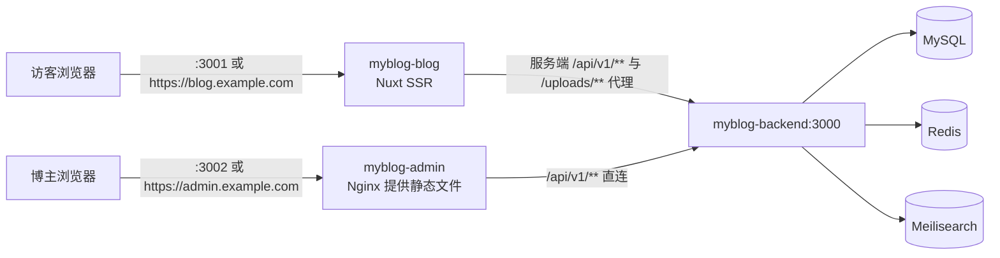

# MyBlog 部署指南（v2.8 现行版）

> 本文档按**当前仓库的真实配置**编写（`docker-compose.yml` / `.env.docker.example` /
> 各 Dockerfile / `nginx.conf` / `myblog-express/app.js` 的实际行为），覆盖从「拿到服务器」
> 到「域名 + HTTPS 上线」的完整流程。
>
> 读者前提：会用 SSH 登录 Linux、能看懂命令行。完全没接触过命令行的请看
> [`DEPLOY-BEGINNERS.md`](./DEPLOY-BEGINNERS.md)（零基础版）。

---

## 目录

1. [现状速览：跑起来是什么样](#一现状速览跑起来是什么样)
2. [先选部署形态](#二先选部署形态)
3. [服务器与网络准备](#三服务器与网络准备)
4. [拉取代码](#四拉取代码)
5. [配置 .env.docker（全量逐项说明）](#五配置-envdocker全量逐项说明)
6. [构建与启动](#六构建与启动)
7. [验收：怎么确认真的好了](#七验收怎么确认真的好了)
8. [形态 2：域名 + Nginx + HTTPS](#八形态-2域名--nginx--https)
9. [首次登录与初始化](#九首次登录与初始化)
10. [邮件通知（可选）](#十邮件通知可选)
11. [时间字段与时区（必须一次配对）](#十一时间字段与时区必须一次配对)
12. [数据备份与恢复](#十二数据备份与恢复)
13. [日常运维](#十三日常运维)
14. [更新代码 / 重新构建的判定](#十四更新代码--重新构建的判定)
15. [切换后端：Express ↔ Spring Boot](#十五切换后端express--spring-boot)
16. [故障排查](#十六故障排查)
17. [附录 A：环境变量速查](#附录-a环境变量速查)
18. [附录 B：目录与数据卷](#附录-b目录与数据卷)
19. [附录 C：上线检查清单](#附录-c上线检查清单)

---

## 一、现状速览：跑起来是什么样

### 1.1 七个容器

`docker compose` 一次拉起 7 个容器，全部挂在 `myblog-net` 网络上：

| 容器 | 技术栈 | 容器内端口 | 默认映射到宿主机 | 作用 |
| ---- | ------ | ---------- | ---------------- | ---- |
| `myblog-backend` | Express 5（默认）/ Spring Boot 4 | 3000 | `3000` | REST API，前缀 `/api/v1`，另有 `/health` |
| `myblog-blog` | Nuxt 3 SSR | 3001 | `3001` | 博客前台；**同时代理 `/api/v1/**` 与 `/uploads/**` 到后端** |
| `myblog-admin` | Vue 3 SPA + 容器内 Nginx | 80 | `3002` | 管理后台；容器自带 SPA fallback |
| `mysql` | MySQL 8.0 | 3306 | `3307` | 数据库（避开宿主机自带的 3306） |
| `redis` | Redis 7 | 6379 | `6379` | 缓存 |
| `meilisearch` | Meilisearch v1.10 | 7700 | `7700` | 全文搜索（未就绪时自动降级 SQL LIKE） |
| `myblog-backup` | Alpine + crond | — | — | 每天 02:00 备份数据库并校验 |

### 1.2 数据卷（删容器不丢数据）

`mysql-data` / `redis-data` / `meili-data` / `uploads-data` / `backup-data`。

> `uploads-data` 同时挂到后端的 `/app/uploads`。**所有上传图片都在这一个卷里**，
> 换后端（Express ↔ Spring）时不用搬文件。

### 1.3 请求是怎么走的



两个关键结论（决定了后面 `nginx.conf` 怎么写）：

1. **`myblog-blog` 自带 API 与上传文件的代理**（`nuxt.config.ts` 的 `routeRules` +
   `server/api/v1/[...segments].ts`）。浏览器只跟博客同源通信即可，**不需要**再为它单独配
   `/api`、`/uploads` 的反代，也不需要把公网域名填进 `NUXT_API_BASE`。
2. **`myblog-admin` 的 SPA 必须挂在「域名根」上**。它的构建没有设置 Vite `base`，
   资源路径是 `/assets/xxx.js`，而客户端路由前缀是 `/admin/**`（`createWebHistory('/')`
   + `/admin/dashboard` 这类路由）。
   - 挂在自己的域名根（`https://admin.example.com`）→ 正常。
   - 挂到 `https://blog.example.com/admin` 子路径 → **必然坏**：资源请求 `/assets/*.js`
     会落到博客前台、路由前缀又被剥掉一层。
   - 所以第 8 节给的是**两个子域名**的写法，仓库根目录的 `nginx.conf` 模板也是这个结构
     （`deploy/k8s/myblog.yaml` 的 Ingress 同样把 admin 单独放在 `admin.your-domain.com` 上）。

---

## 二、先选部署形态

| 形态 | 适用 | 访问方式 | 需要域名 | 需要 Nginx | 耗时 |
| ---- | ---- | -------- | -------- | ---------- | ---- |
| **形态 1：IP + 端口直连** | 先跑通、内网/自用、演示 | `http://IP:3001`、`http://IP:3002` | 不用 | 不用 | 约 20 分钟 |
| **形态 2：域名 + HTTPS** | 对外开放、正式使用 | `https://blog.你的域名`、`https://admin.你的域名` | 需要 | 需要 | 约 1 小时 |
| 形态 3：Kubernetes | 已有集群 | 自行配 Ingress | — | — | 超纲 |

> 建议：**先用形态 1 跑通再切形态 2**。形态 2 的前端资源是「构建期注入地址」的，
> 切形态时只要重新构建前端两个镜像即可，数据不受影响。

---

## 三、服务器与网络准备

### 3.1 规格

| 项 | 建议 | 说明 |
| ---- | ---- | ---- |
| CPU / 内存 | 2 核 4G | 能跑，但构建峰值吃紧，见 6.1 |
| 磁盘 | 40G 以上 | 镜像 + 数据卷 + 备份 |
| 系统 | Ubuntu 24.04 LTS | 优先选带 Docker 的应用镜像 |

### 3.2 确认 Docker 与 Compose

```bash
docker --version           # 需要 24.0+
docker compose version     # 需要 v2.20+，注意是 docker compose（空格）
```

没有装的话：

```bash
curl -fsSL https://get.docker.com | bash
systemctl enable --now docker
```

### 3.3 国内镜像加速（强烈建议）

```bash
sudo mkdir -p /etc/docker
sudo tee /etc/docker/daemon.json > /dev/null <<'EOF'
{
  "registry-mirrors": ["https://docker.m.daocloud.io", "https://mirror.ccs.tencentyun.com"]
}
EOF
sudo systemctl daemon-reload && sudo systemctl restart docker
```

### 3.4 放行端口

| 形态 | 需要放行 |
| ---- | -------- |
| 形态 1 | `22`、`3000`、`3001`、`3002` |
| 形态 2（调试期） | `22`、`80`、`443`、`3000`、`3001`、`3002` |
| 形态 2（稳定后） | `22`、`80`、`443`（**关掉 3000-3002**） |

> `3307`（MySQL）与 `7700`（Meili）**不要**对公网放行。真要远程连库就改用 SSH 隧道。

### 3.5 加 swap（2 核 4G 建议）

```bash
sudo fallocate -l 2G /swapfile && sudo chmod 600 /swapfile
sudo mkswap /swapfile && sudo swapon /swapfile
echo '/swapfile none swap sw 0 0' | sudo tee -a /etc/fstab
```

---

## 四、拉取代码

```bash
sudo mkdir -p /opt/myblog && sudo chown $USER /opt/myblog
```

仓库是公开的，**在服务器上直接克隆即可**（不需要配置 SSH key 或 token）：

```bash
sudo apt install -y git        # CentOS / 阿里云 Linux 用 yum install -y git

# ⚠️ 必须带 --depth 1：仓库历史里有 100+ MB 早已不再跟踪的文件（早期提交过的
#    node_modules 与 uploads 图片），全量克隆在慢网络下要一两个小时
git clone --depth 1 --single-branch --branch v2-myblog \
  https://github.com/luoxiwhyye/MyBlog.git /opt/myblog
cd /opt/myblog

git branch --show-current      # 应输出 v2-myblog
```

确认根目录层级正确：

```bash
ls /opt/myblog                 # 必须能直接看到 docker-compose.yml 与 .env.docker.example
```

> ⚠️ `git clone` 要求**目标目录是空的**：`/opt/myblog` 里若已有东西，先把它们移走。
> 中途失败过记得先 `rm -rf /opt/myblog` 再重试。
>
> **为什么用 clone 而不是上传整个文件夹**：构建上下文是相对路径（`./myblog-express` 等），
> 手工上传时漏一个目录就会构建失败（历史上最容易漏的是 `scripts/` 与 `.dockerignore`）；
> clone 不会有这个问题，而且更新只需 `git pull`。
>
> **克隆得到的东西**：`docker-compose.yml`、四份 Dockerfile、`scripts/`（含备份与自检脚本）、
> `.env.docker.example`、`nginx.conf`、三份部署文档。
>
> **克隆得不到的东西**：`.env.docker`（含密钥，被 `.gitignore` 排除）与 `uploads/` 里的图片
> （生产环境走数据卷）。前者下一步从模板创建，后者是空库首启无需迁移。
>
> **浅克隆的代价**：看不到历史提交（`git log` 只有一条），部署用不到；`git pull` 照常可用。
> 想看历史就 `git fetch --unshallow`。
>
> ⚠️ **不要在服务器上直接改源码**：更新方式就是 `git pull`，本地有未提交改动时会冲突。
> 想调整行为优先改 `.env.docker` 或走后台界面。

---

## 五、配置 `.env.docker`（全量逐项说明）

```bash
cd /opt/myblog
cp .env.docker.example .env.docker
nano .env.docker
```

> `docker compose` 默认只读 `.env`，所以下面所有命令都带 `--env-file .env.docker`。
> 想省掉这个参数就把文件直接命名为 `.env`（但容易和子项目 `.env` 混淆，不推荐）。
>
> **⚠️ 只要弄这一个文件。** 仓库里另有 4 个 `.env.example`（在 `myblog-express/`、
> `myblog-springboot/`、`myblog-vue/myblog-blog/`、`myblog-vue/myblog-admin/`）——
> 那是给人**本地跑 `npm run dev`** 用的，Docker 部署不需要创建，也不要照它们去改容器。
> 因为注入方式不同：compose 用 `environment:` 与构建参数把变量直接传进容器，
> 容器里不读 `.env` 文件。对照表见 [`DEPLOY.md`](./DEPLOY.md#2-配置环境变量)。

### 5.1 必改四项（不改等于把后台敞开）

| 变量 | 怎么填 |
| ---- | ------ |
| `DB_PASSWORD` | MySQL root 密码，16 位以上随机串 |
| `JWT_SECRET` | 随机串，32 字节以上 |
| `MEILI_MASTER_KEY` | 随机串（**错了不会报错，只会静默降级成 SQL LIKE 搜索**） |
| `BLOGGER_EMAIL` | **你自己的真实邮箱**（默认 `admin@example.com` 是保留域名，通知必退信） |

```bash
openssl rand -hex 32      # 跑三次，分别填进上面三个密钥类变量
```

### 5.2 分组说明

**（1）时区三件套 — 必须表示同一个时区**

| 变量 | 含义 | 默认 |
| ---- | ---- | ---- |
| `TZ` | MySQL 写库墙钟 + 后端进程 + 前台 SSR 直出，都用它 | `Asia/Shanghai` |
| `DB_TIME_ZONE` | Express 解释 datetime 字面量的**固定偏移**（mysql2 不支持 IANA 名） | `+08:00` |
| `APP_TIME_ZONE` | Spring Boot 的**源时区**（IANA 名） | `Asia/Shanghai` |

三项不一致**不会报错**，只会让所有时间字段整体偏移（典型 8 小时）。详见第 11 节。

**（2）数据库 / 缓存 / 搜索**

| 变量 | 默认 | 说明 |
| ---- | ---- | ---- |
| `DB_NAME` | `myblog` | 库名；首次启动自动建表 |
| `DB_PORT` | `3307` | 宿主机端口，避开本机 3306 |
| `REDIS_PASSWORD` | 空 | 留空 = Redis 不设密码 |
| `REDIS_PORT` | `6379` | |
| `MEILI_HOST` | `meilisearch` | 容器间服务名，**不要改** |
| `MEILI_PORT` | `7700` | 容器内端口；宿主映射同名 |

**（3）JWT**

| 变量 | Express | Spring Boot |
| ---- | ------- | ----------- |
| `JWT_EXPIRES_IN` | 时长串 `7d` / `24h` | **毫秒数** `604800000` |

> 两端格式不同。切到 Spring Boot 时必须改成毫秒，否则启动就报
> `Failed to convert value of type 'java.lang.String' to required type 'long'`。

**（4）服务端口映射**（改的是宿主机这一侧）

`BACKEND_PORT=3000` / `BLOG_PORT=3001` / `ADMIN_PORT=3002`

**（5）前端地址 — 最容易配错的一组**

| 变量 | 谁在用 | 形态 1（IP） | 形态 2（域名） |
| ---- | ------ | ------------ | -------------- |
| `NUXT_API_BASE` | **博客容器服务端**访问后端 | `http://myblog-backend:3000/api/v1` | 同左（**不要改**） |
| `NUXT_SITE_URL` | 博客的 canonical / sitemap / OG | `http://<IP>:3001` | `https://blog.你的域名` |
| `VITE_API_BASE` | **后台浏览器端**访问后端 | `http://<IP>:3000/api/v1` | `/api/v1`（同源相对路径） |
| `FRONTEND_ORIGIN` | 后端 CORS 白名单 | `http://<IP>:3001` | `https://blog.你的域名` |
| `ADMIN_ORIGIN` | 后端 CORS 白名单 | `http://<IP>:3002` | `https://admin.你的域名` |

> 三个坑：
> 1. `NUXT_API_BASE` 是**容器内互相称呼的名字**，`myblog-backend` 只在 Docker 网络里能解析，
>    填公网域名反而多绕一圈。
> 2. `VITE_API_BASE` 是**构建期**写进 JS 的，改完必须重新 `build` 前端（见第 14 节）。
> 3. `localhost` 与 `127.0.0.1` 在 CORS 白名单里是**两个不同的 origin**，页面地址与
>    `*_ORIGIN` 必须逐字一致。

**（6）站点信息**

| 变量 | 说明 |
| ---- | ---- |
| `SITE_URL` | 邮件里文章 / 留言板链接的前缀。**必须是收信人能打开的地址**；留空、`localhost`、`192.168.*` 都会让收信人点开是空页（后端发信前会 warn，后台「邮件通知」Tab 也会显示告警条） |
| `SITE_NAME` | 邮件署名与主题里的站点名 |
| `APP_BASE_URL` | 拼进**数据库**的图片绝对地址前缀 `<APP_BASE_URL>/uploads/...` |

> `APP_BASE_URL` 不填会回退成 `http://localhost:<PORT>`：
> - 博客前台会自动归一化，**页面显示正常**；
> - 但**后台是把库里的地址直接绑到 ``** 的 → 封面图、头像、表情图会全部裂掉。
>
> 所以**一定要填**：形态 1 填 `http://<IP>:3000`（后端直接对外），
> 形态 2 填 `https://blog.你的域名`（博客会把 `/uploads/**` 代理到后端）。
> 它只影响**新上传**的图，改完不需要重建前端，但**存量行要另行回填**（见 16.6）。

**（7）博主初始账号 — 只生效一次**

`BLOGGER_USERNAME` / `BLOGGER_PASSWORD` / `BLOGGER_NICKNAME` / `BLOGGER_EMAIL`

> 这四项只在「库里还没有博主」时用于创建（Express `initBlogger` / Spring `BlogInitRunner`
> **只创建、不更新**）。**库里已有博主时改这里没有任何效果**，请到后台「个人资料」改。

**（8）SMTP 邮件通知 — 可选**

不配则评论 / 回复 / 留言的通知自动停用，功能本身照常。

| 变量 | 说明 |
| ---- | ---- |
| `SMTP_HOST` | 服务商 SMTP 域名：QQ `smtp.qq.com`、163 `smtp.163.com`、Gmail `smtp.gmail.com` |
| `SMTP_PORT` | 常见 `465`；Outlook `587` |
| `SMTP_SECURE` | `ssl` / `starttls` / `none`；**留空按端口推导**（465→ssl、587→starttls） |
| `SMTP_USER` | 发信邮箱的完整地址 |
| `SMTP_PASS` | **授权码**（不是登录密码） |
| `SMTP_FROM` | 显示的发信人，如 `MyBlog <you@qq.com>`；不填回退 `SMTP_USER` |

> 两端都判定为「可用」的条件是 **host + user + pass 三项齐全**，缺一项都算未启用。
> 改完必须重启后端进程（`.env` 只在启动时读一次）。

**（9）其它**

| 变量 | 默认 | 说明 |
| ---- | ---- | ---- |
| `TRUST_PROXY` | `1` | 信任右起 N 跳代理，只认 `X-Forwarded-For`；`0` = 直连不信任转发头。**限流 / 评论入库 / 留言入库都依赖它取真实访客 IP**，配错会让所有访客共用一个限流桶 |
| `BACKUP_CRON` | `0 2 * * *` | 备份容器内的 cron 表达式 |
| `BACKUP_RETENTION_DAYS` | `14` | 备份保留天数 |

### 5.3 两组「照着抄」的样例

**形态 1（IP 直连）**——把 `<IP>` 换成服务器公网 IP：

```env
TZ=Asia/Shanghai
DB_PASSWORD=<随机串>
DB_TIME_ZONE=+08:00
APP_TIME_ZONE=Asia/Shanghai
JWT_SECRET=<随机串>
MEILI_MASTER_KEY=<随机串>
BLOGGER_EMAIL=you@qq.com
SITE_URL=http://<IP>:3001
SITE_NAME=我的博客
APP_BASE_URL=http://<IP>:3000
NUXT_API_BASE=http://myblog-backend:3000/api/v1
NUXT_SITE_URL=http://<IP>:3001
VITE_API_BASE=http://<IP>:3000/api/v1
FRONTEND_ORIGIN=http://<IP>:3001
ADMIN_ORIGIN=http://<IP>:3002
TRUST_PROXY=1
```

**形态 2（域名 + Nginx）**：

```env
SITE_URL=https://blog.你的域名
SITE_NAME=我的博客
APP_BASE_URL=https://blog.你的域名
NUXT_API_BASE=http://myblog-backend:3000/api/v1
NUXT_SITE_URL=https://blog.你的域名
VITE_API_BASE=/api/v1
FRONTEND_ORIGIN=https://blog.你的域名
ADMIN_ORIGIN=https://admin.你的域名
TRUST_PROXY=1
```

---

## 六、构建与启动

### 6.0 先设构建加速源（中国大陆服务器必做）

镜像构建要从 **Alpine 官方 CDN** 与 **npm 官方源**下载。境内服务器直连可能只有几十 KB/s ——
实测 `apk add` 两个小包花了 **428 秒**，是整次构建耗时的 95%。在 `.env.docker` 里加两行：

```env
APK_MIRROR=mirrors.tencent.com
NPM_REGISTRY=https://registry.npmmirror.com
```

- 可选 `APK_MIRROR`：`mirrors.tencent.com` ｜ `mirrors.aliyun.com` ｜ `mirrors.ustc.edu.cn`
- 这两项**只影响构建期**（Dockerfile 的 `ARG`），与运行时行为无关；境外服务器留空即用官方源。

### 6.1 先算内存账

`npm install` + `nuxt build` 峰值约 2GB，2 核 4G 上余量不大。按顺序做：

1. 已按 3.5 加了 2G swap；
2. 构建时先停掉搜索容器腾内存：

```bash
cd /opt/myblog
docker compose --env-file .env.docker stop meilisearch || true
```

3. 逐个构建，避免并发峰值：

```bash
docker compose --env-file .env.docker build myblog-backend
docker compose --env-file .env.docker build myblog-admin
docker compose --env-file .env.docker build myblog-blog     # 最重的一个
```

> 机器更小（2 核 2G）且构建反复被 OOM kill，就改为**本地构建再传产物**：
> 本地 `npm run build` 后把 `myblog-vue/myblog-blog/.output` 传上去，用
> `node .output/server/index.mjs` 起一个精简容器。这是绕开构建峰值的唯一稳办法。

### 6.2 启动

```bash
cd /opt/myblog
docker compose --env-file .env.docker up -d --build
```

首次会拉取 `mysql:8.0`、`redis:7-alpine`、`getmeili/meilisearch:v1.10` 等基础镜像，
视网络 3 到 10 分钟。中途 `Ctrl+C` 不会白干，重跑会复用已完成层。

### 6.3 看状态

```bash
docker compose ps
```

期望：

```
NAME                STATUS
myblog-mysql        Up (healthy)
myblog-redis        Up (healthy)
myblog-meilisearch  Up (healthy)
myblog-backend      Up
myblog-blog         Up
myblog-admin        Up
myblog-backup       Up
```

`myblog-backend` 会等 mysql / redis `healthy` 之后才启动（`depends_on` 的
`condition: service_healthy`），所以头一分钟看到它 `Created` 是正常的。

---

## 七、验收：怎么确认真的好了

不要只看「容器 Up」就宣布成功。按下面四步：

### 7.1 后端健康检查（信息量最大）

```bash
curl -s http://127.0.0.1:3000/health | python3 -m json.tool 2>/dev/null || curl -s http://127.0.0.1:3000/health
```

注意：`/health` **不是** `{code,message,data}` 包壳，直接返回下面这个结构：

```jsonc
{
  "status": "ok",
  "timestamp": "...",
  "uptime": 12.34,
  "database":      { "status": "ok" },
  "redis":         { "status": "ok" },
  "meilisearch":   { "status": "ok", "reason": "" },
  "mail":          { "status": "disabled" },
  "imageVariants": { "status": "ok", "reason": "" }
}
```

逐块读法：

| 块 | 取值 | 含义 |
| ---- | ---- | ---- |
| `database` | `ok` / `error` | 数据库连不上就查 `DB_*` 与 mysql 容器状态 |
| `redis` | `ok` / `not_configured` / `error` | 未配置会降级为数据库直查 |
| `meilisearch` | `ok` / `unauthorized` / `unavailable` / `not_configured` | **`unauthorized` = `MEILI_MASTER_KEY` 填错**，此时搜索会静默降级 SQL LIKE |
| `mail` | `ok` / `disabled` | 只有 host+user+pass 三项齐全才是 `ok` |
| `imageVariants` | `ok` / `disabled` | `disabled` = sharp 没装好，缩略图不生成（前端会回退原图，不影响功能） |

> 判断 Meili 是否真的可用**不能只探 `/health`**：Meili 的 `/health` 是公开端点，
> 密钥错也返回 200。需要密钥的是 `/version`：
> `curl -H "Authorization: Bearer $MEILI_MASTER_KEY" http://127.0.0.1:7700/version`

### 7.2 三个入口都通

```bash
curl -sI http://127.0.0.1:3001/ | head -1      # 200
curl -sI http://127.0.0.1:3002/ | head -1      # 200
curl -s  http://127.0.0.1:3001/api/v1/settings | head -c 200   # 走博客的代理，应返回 JSON
```

第三条很关键：它证明「博客 → 后端」这条代理链路是通的。

### 7.3 浏览器实测

| 打开 | 检查 |
| ---- | ---- |
| `http://<IP>:3001` | 首页有内容；换一页、点开一篇文章 |
| `http://<IP>:3002` | 登录页出现，`admin` / `admin123` 能进 |
| 后台 → 文章列表 | 封面缩略图**不裂**（裂了就是 `APP_BASE_URL` 没配对，见 16.6） |
| 后台 → 系统设置 · 邮件通知 | 显示当前 SMTP 状态；可点「发送测试邮件」 |

### 7.4 浏览器控制台自检

按 F12 看 Console / Network：

- 有 `CORS` 报错 → `FRONTEND_ORIGIN` / `ADMIN_ORIGIN` 与页面实际 origin 不逐字一致；
- 请求发往 `localhost:3000` 或 `myblog-backend:3000` → `VITE_API_BASE` 没改成浏览器可达地址；
- 404 的 `_thumb.webp` → 正常降级行为（`imageVariants` 为 `disabled` 时会这样）。

---

## 八、形态 2：域名 + Nginx + HTTPS

### 8.1 两个子域名

| 域名 | 指向 | 说明 |
| ---- | ---- | ---- |
| `blog.你的域名` | 服务器 IP（A 记录） | 博客前台 |
| `admin.你的域名` | 服务器 IP（A 记录） | 管理后台 |

`admin` 用独立子域名不是洁癖，而是第 1.3 节说的**技术限制**：这个 SPA 的资源路径是
`/assets/**`、路由前缀是 `/admin/**`，只有挂在域名根才自洽。

另一种同样可行的做法：**admin 不挂子域名，继续用 `http://IP:3002`**（此时
`VITE_API_BASE` 仍填 `http://IP:3000/api/v1`），只是浏览器会提示「不安全」。
正式对外建议还是给 admin 配子域名 + HTTPS，否则管理员密码是明文传输的。

### 8.2 安装 Nginx 与证书工具

```bash
sudo apt update
sudo apt install -y nginx certbot python3-certbot-nginx
```

> 仓库根目录的 `nginx.conf` 就是一份可直接用的模板（含 SSL / Gzip / 缓存 / 安全头，
> 以及下面这两个域名块），把域名与证书路径替换掉即可：
>
> ```bash
> sudo cp /opt/myblog/nginx.conf /etc/nginx/sites-available/myblog
> sudo ln -sf /etc/nginx/sites-available/myblog /etc/nginx/sites-enabled/myblog
> ```
>
> 若直接用它，可跳过 8.3 / 8.4，改完域名后从 8.5 继续（它默认监听 443 并需要证书文件，
> 所以先用 `certbot --nginx` 签发证书最省事）。
>
> 下面两节是拆开的最小配置，方便你理解每一段在干什么。

### 8.3 博客前台

```bash
sudo nano /etc/nginx/sites-available/myblog-blog
```

```nginx
server {
    listen 80;
    server_name blog.你的域名;

    # 上传限制（后端 body 上限是 10MB，这里给一点余量）
    client_max_body_size 20m;

    # 博客容器自带 /api/v1/** 与 /uploads/** 的代理，这里全部交给它即可
    location / {
        proxy_pass http://127.0.0.1:3001;
        proxy_http_version 1.1;
        proxy_set_header Host              $host;
        proxy_set_header X-Real-IP         $remote_addr;
        proxy_set_header X-Forwarded-For   $proxy_add_x_forwarded_for;
        proxy_set_header X-Forwarded-Proto $scheme;
        proxy_set_header Connection        "";

        proxy_connect_timeout 5s;
        proxy_send_timeout    60s;
        proxy_read_timeout    60s;
    }
}
```

### 8.4 管理后台

```bash
sudo nano /etc/nginx/sites-available/myblog-admin
```

```nginx
server {
    listen 80;
    server_name admin.你的域名;

    client_max_body_size 20m;

    # 后台用相对路径 /api/v1 调接口，这里转发到后端（同源，无需 CORS）
    location /api/ {
        proxy_pass http://127.0.0.1:3000;
        proxy_set_header Host              $host;
        proxy_set_header X-Real-IP         $remote_addr;
        proxy_set_header X-Forwarded-For   $proxy_add_x_forwarded_for;
        proxy_set_header X-Forwarded-Proto $scheme;
    }

    # 若把 APP_BASE_URL 指到了 admin 域名，图片走这里（可选，留着无害）
    location /uploads/ {
        proxy_pass http://127.0.0.1:3000;
        proxy_set_header Host $host;
        expires 7d;
        add_header Cache-Control "public, max-age=604800";
    }

    # SPA：容器内的 Nginx 已做 index.html 回退，这里原样转发
    location / {
        proxy_pass http://127.0.0.1:3002;
        proxy_http_version 1.1;
        proxy_set_header Host              $host;
        proxy_set_header X-Real-IP         $remote_addr;
        proxy_set_header X-Forwarded-For   $proxy_add_x_forwarded_for;
        proxy_set_header X-Forwarded-Proto $scheme;
        proxy_set_header Connection        "";
    }
}
```

启用：

```bash
sudo ln -sf /etc/nginx/sites-available/myblog-blog  /etc/nginx/sites-enabled/
sudo ln -sf /etc/nginx/sites-available/myblog-admin /etc/nginx/sites-enabled/
sudo rm -f /etc/nginx/sites-enabled/default
sudo nginx -t && sudo systemctl reload nginx
```

> 此时先不用 HTTPS 验证一次：`http://blog.你的域名` 应能看到博客。

### 8.5 申请证书

```bash
sudo certbot --nginx -d blog.你的域名
sudo certbot --nginx -d admin.你的域名
```

交互里选 **Redirect（HTTP 跳 HTTPS）**。证书自动续期。

### 8.6 把地址换成域名并重建前端

```bash
cd /opt/myblog
nano .env.docker
```

把 5.3「形态 2」那一段填进去（重点是 `NUXT_SITE_URL`、`VITE_API_BASE=/api/v1`、
`APP_BASE_URL`、两个 `*_ORIGIN`），然后**必须重建前端**（前端地址是构建期注入的）：

```bash
docker compose --env-file .env.docker build myblog-blog myblog-admin
docker compose --env-file .env.docker up -d
```

最后回到云控制台，把 `3000 / 3001 / 3002` 从安全组删掉，只留 `22 / 80 / 443`。

---

## 九、首次登录与初始化

### 9.1 登录并立刻改密码

| 项 | 默认值 |
| ---- | ------ |
| 地址 | `https://admin.你的域名`（形态 1 是 `http://<IP>:3002`） |
| 用户名 | `admin` |
| 密码 | `admin123` |

> ⚠️ 若想更安全，可以在**第一次启动之前**把 `.env.docker` 的 `BLOGGER_PASSWORD` 改成强口令
> （它只在「创建博主」时生效）；否则就用默认口令登录，**第一件事**：右上角头像 → **个人资料** →
> 「修改密码」页签改掉默认密码；再在「基本信息」里把邮箱改成真实邮箱（这是邮件通知的**收件人**）。

### 9.2 初始化可能不需要你做

首次启动时后端会**自动建表**（MySQL 容器挂载了 `myblog-express/myblog-1.1.sql`
作为初始化脚本）并**自动创建博主账号**。所以正常情况下你不需要手动导入任何 SQL。

需要手动重建博主时：

```bash
docker compose exec myblog-backend node scripts/initBlogger.js
```

> 它只创建、不更新；库里已有博主时不会覆盖密码。

### 9.3 站点信息都在后台改

站点名称、头像、页脚、备案号、社交链接、主题色、后台入口等都在
**系统设置** 里，保存即生效，**不需要重启任何容器**。

---

## 十、邮件通知（可选）

四类通知：① 新评论 → 博主（创建即发）② 回复 → 被回复者（该回复**审核通过后**才发）
③ 新留言 → 博主 ④ 留言审核通过 → 留言者本人。②④ 需要提交者勾选了「接收回复邮件」。

### 10.1 配置

在 `.env.docker` 填好 `SMTP_HOST` / `SMTP_PORT` / `SMTP_USER` / `SMTP_PASS`
（`SMTP_SECURE`、`SMTP_FROM` 可留空），然后：

```bash
docker compose --env-file .env.docker up -d
docker compose restart myblog-backend
```

### 10.2 验证

后台 **系统设置 · 邮件通知**：

- 面板显示当前状态、服务商字段、`reason`（缺哪一项）、收件人；
- 收件人仍是 `admin@example.com` 会显示红色告警条（保留域名，必退信）；
- `SITE_URL` 是空 / `localhost` / 内网地址会显示橙色告警条（**收信人点开是空页**）；
- 点「发送测试邮件」真实发一封，失败会带原因（400）。

### 10.3 发不出信时的排查顺序

1. `SMTP_PASS` 是不是**授权码**（不是邮箱登录密码）；
2. 邮箱服务商是否已开启 SMTP 服务；
3. `SMTP_SECURE` / 端口是否与服务商要求一致（465 用 ssl，587 用 starttls）；
4. 收件人（博主邮箱）是否还是 `admin@example.com`；
5. 服务器能否出网到 `SMTP_HOST:SMTP_PORT`（`nc -zv smtp.qq.com 465`）；
6. 改完 `.env.docker` 有没有重启后端。

---

## 十一、时间字段与时区（必须一次配对）

时间字段在接口里是 **UTC 瞬时串**（`2026-09-13T11:10:49.000Z`，毫秒固定 3 位）。
它依赖**四个位置时区一致**：

| 位置 | 由谁决定 | 取值形式 |
| ---- | -------- | -------- |
| MySQL 写入端（`NOW()`） | compose 里 `mysql` 服务的 `TZ` | IANA 名 `Asia/Shanghai` |
| Express 读时区 | `DB_TIME_ZONE` | **固定偏移** `+08:00` |
| Spring 源时区 | `APP_TIME_ZONE` | IANA 名 `Asia/Shanghai` |
| 博客 SSR 直出 | compose 里 `myblog-blog` 服务的 `TZ` | IANA 名 |

不一致时**不会报错**，只会整体偏移。Express 启动时会自检并打印偏移分钟数的告警，
启动日志里看到这类告警就说明配错了。

> **改 MySQL 的 `TZ` 会波及存量数据**：datetime 列存的是墙钟，改时区后
> **旧行与新行不同区**。真要改，先备份，再决定是「只改配置」还是「连数据一起迁移」。

---

## 十二、数据备份与恢复

### 12.1 自动备份

`myblog-backup` 容器按 `BACKUP_CRON`（默认每天 02:00）执行
`scripts/backup.sh`：导出 → 生成同名 `.sha256` → **立即校验**（gzip + sha256），
按 `BACKUP_RETENTION_DAYS` 清理旧备份。备份在卷 `backup-data`（容器内 `/backups`）。

### 12.2 手动备份 / 校验 / 恢复

```bash
# 立即备份一次
docker compose exec myblog-backup bash /scripts/backup.sh

# 只校验最近一次（不产生新备份）
docker compose exec myblog-backup bash -c "VERIFY_ONLY=1 bash /scripts/backup.sh"

# 列出备份
docker compose exec myblog-backup ls -lh /backups

# 恢复（会先校验 sha256 与 gzip 完整性，通过才导入；需确认）
docker compose exec myblog-backup bash -c "CONFIRM=1 bash /scripts/restore.sh /backups/myblog_YYYYMMDD_HHMMSS.sql.gz"
```

把备份拷到本地留一份（强烈建议，服务器整机故障时卷也没了）：

```bash
# -T 关掉伪终端，否则 tar 的二进制流会被 TTY 破坏
docker compose exec -T myblog-backup tar -c -C /backups . > /tmp/backups.tar
scp root@<服务器IP>:/tmp/backups.tar ./
```

### 12.3 别忘了演练

**定期真的恢复一次**（可以恢复到一台测试机或新库）。只有「恢复过」的备份才算备份。

> 不要用 `docker compose down -v` 做「重置」——`-v` 会删掉全部数据卷，不可恢复。

---

## 十三、日常运维

```bash
cd /opt/myblog

docker compose ps                              # 状态
docker compose logs -f myblog-backend          # 实时日志（Ctrl+C 退出）
docker compose logs --tail=200 myblog-blog     # 最近 200 行
docker compose restart myblog-backend          # 重启单个
docker compose --env-file .env.docker up -d    # 应用 .env 变化（重建容器）
docker compose stop                            # 停止（保留容器与卷）
docker compose down                            # 停止并删除容器（保留卷）

docker system prune -af                        # 清理无用镜像/构建缓存（每月一次）
docker volume ls | grep myblog                 # 数据卷：只读检查，别删
df -h ; free -h                                # 磁盘 / 内存
```

Nginx 侧：

```bash
sudo nginx -t && sudo systemctl reload nginx
sudo systemctl status nginx
```

> 清理镜像前确认 `docker compose ps` 一切正常；`docker system prune -af` 不会动数据卷，
> 但会删掉未使用的**镜像**，下次启动可能需要重新拉取。

### 13.1 如果这是对外开放的演示站

公网跑久了，`uploads/`、评论、留言板会被访客塞满垃圾数据。想定期回到干净状态：

```bash
# 举例：每天 03:00 重置（注意 -v 会删掉全部数据卷）
0 3 * * * cd /opt/myblog && docker compose down -v && docker compose --env-file .env.docker up -d
```

> ⚠️ `docker compose down -v` **会删掉数据库、图片和备份，不可恢复**，只适用于演示站。
> 正式博客千万别这么干；正式站要靠第 12 节的备份与恢复。

---

## 十四、更新代码 / 重新构建的判定

这是最容易做错的一步：**哪些改动需要 `build`，哪些只要 `up -d`**。

| 改了什么 | 需要做什么 |
| -------- | ---------- |
| `.env.docker` 里的**后端**变量（DB / JWT / SMTP / SITE_URL / TRUST_PROXY / APP_BASE_URL） | `up -d`（容器会以新变量重建） |
| `.env.docker` 里的**前端**变量（`NUXT_SITE_URL`、`NUXT_API_BASE`、`VITE_API_BASE`） | **必须 `build` 对应前端**，然后 `up -d` |
| 后端源码 | `build myblog-backend` + `up -d` |
| 博客前台源码 | `build myblog-blog` + `up -d` |
| 后台源码 | `build myblog-admin` + `up -d` |
| `docker-compose.yml` | `up -d`（必要时 `--build`） |
| 只是在**后台界面**改的设置（站点名、主题色、社交链接…） | 什么都不用做，保存即生效 |

标准流程：

```bash
cd /opt/myblog
# 1. 拉取新代码
git pull

# 2. 重建受影响的服务
docker compose --env-file .env.docker build myblog-blog myblog-admin myblog-backend
docker compose --env-file .env.docker up -d
```

> 拉取失败（`local changes would be overwritten`）说明服务器上有未提交的本地改动 ——
> 先 `git status` 看清是什么，确认无用再 `git checkout -- <文件>` 丢弃；
> **不要**用 `git reset --hard` 一把梭（会连你手动调过的配置一起丢）。
>
> 反过来说：想让 `git pull` 永远顺利，就别在服务器上改仓库里的文件
> （`.env.docker` 不在仓库里，随便改）。
>
> 改了后端 `package.json` 记得在本地先跑 `npm install --package-lock-only` 同步 lockfile：
> 后端 Dockerfile 用 `npm ci`，lockfile 与 `package.json` 不一致会让 `docker build` 直接失败。

---

## 十五、切换后端：Express ↔ Spring Boot

`docker-compose.yml` 里两个后端是**互斥的两个服务段**：
`myblog-backend`（Express，默认启用）与注释掉的同一名字的 Spring 段。
切换 = 注释掉 Express 段、取消注释 Spring 段。

切换前必做两件事：

1. **`JWT_EXPIRES_IN` 改单位**：Express 是 `7d`，Spring 要 `604800000`（毫秒）；
2. 确认 `UPLOAD_PATH` 在 Docker 场景保持默认 `uploads`（两个容器各自把
   `uploads-data` 卷挂到工作目录下，改默认值会让挂载错位）。

然后：

```bash
docker compose --env-file .env.docker build myblog-backend --no-cache
docker compose --env-file .env.docker up -d myblog-backend
```

Spring 镜像要下 Maven 依赖，**首次构建明显更慢**（可能 10 分钟以上）。

> 两个后端**共用同一个数据库与同一个 uploads 卷**，所以可以随时来回切，数据不丢。
> 但请注意：**Spring 侧的文章写接口**对请求编码的支持范围与 Express 不同，
> 用后台「写文章」时如遇 4xx/5xx，先确认你切到了哪一端。

---

## 十六、故障排查

### 16.1 通用三步

```bash
cd /opt/myblog
docker compose ps                                  # 1. 谁没起来
docker compose logs --tail=200 myblog-backend      # 2. 它说了什么
curl -s http://127.0.0.1:3000/health               # 3. 后端与各依赖状态
```

### 16.2 容器起不来 / 反复重启

```bash
docker inspect myblog-backend --format '{{json .State}}' | head -c 500
docker compose logs myblog-backend
```

常见原因：

- **`myblog-mysql` 一直不 healthy**：首次初始化慢（等 1 分钟）；或 `DB_PASSWORD` 含
  `$`、`&`、`#` 等特殊字符 —— 在 `.env.docker` 的 shell 解析里会出问题，建议只用字母数字；
- **后端启动早于数据库**：正常不会（有 `service_healthy` 依赖），若是自定义 compose 改过则补上；
- **端口被占**：`ss -tlnp | grep -E '3000|3001|3002|3307|6379|7700'`。

### 16.3 浏览器打不开网页

1. 服务器本机先验：`curl -sI http://127.0.0.1:3001/` → 200 说明程序没问题，问题在网络层；
2. 云安全组 / 防火墙是否放行了对应端口；
3. 形态 2 下确认 Nginx 在跑且 `server_name` 与访问的域名一致。

### 16.4 页面能开但数据加载不出来

九成是**构建期地址注入错误**：

- 打开 F12 → Network，看请求打到了哪个 host；
- `myblog-backend:3000` 或 `localhost:3000` 出现在浏览器请求里 = `VITE_API_BASE` 没配成
  浏览器可达地址；
- 改完 `.env.docker` **必须重建前端**（第 14 节）。

### 16.5 搜索"能用但没走搜索引擎"

`MEILI_MASTER_KEY` 填错时，Meili 的索引操作会被 403 拒掉，应用**静默降级为 SQL LIKE**，
表面上一切正常。

```bash
curl -s http://127.0.0.1:3000/health | grep -o '"meilisearch":{[^}]*}'   # 看 status
curl -s -H "Authorization: Bearer <你的key>" http://127.0.0.1:7700/version
```

`unauthorized` → 密钥不对；`unavailable` → 容器没起来或端口不通。

### 16.6 图片裂开 / 上传后看不到

| 现象 | 原因 | 处理 |
| ---- | ---- | ---- |
| **后台**封面、头像、表情全部裂 | `APP_BASE_URL` 没配（拼成 `http://localhost:3000/...`） | 按 5.2（6）填好，**新图**即正常 |
| 前台缩略图 404，大图正常 | WebP 变体没生成（`imageVariants: disabled`） | 前端会自动回退原图，属可接受；想修就重建后端镜像确认 sharp 装好 |
| 换域名后老图裂 | 存量行里存的是旧域名 | 见下 |

存量回填（改完 `APP_BASE_URL` 后想让老图也用新域名）：

```bash
docker compose exec mysql mysql -uroot -p"$DB_PASSWORD" myblog -e \
  "SELECT id, cover_image FROM article WHERE cover_image LIKE 'http://旧地址%' LIMIT 5;"
```

确认无误后再 `UPDATE`（**先备份**，`UPDATE` 前务必跑一遍 `SELECT` 确认范围）：

```sql
UPDATE article SET cover_image = REPLACE(cover_image, 'http://旧地址', 'https://新地址')
 WHERE cover_image LIKE 'http://旧地址%';
```

同类字段还有 `blogger.avatar`、`friend_link.avatar`、`setting.setting_value`
（站点 Logo / 背景图等 image 型配置）、`emoji.content`（`type='image'` 的表情图）、
以及 `article.content` 正文里内嵌的图片地址。**回填前先备份，并先用 `SELECT` 确认范围。**

### 16.7 时间整体偏 8 小时

见第 11 节。检查 `.env.docker` 的 `TZ` / `DB_TIME_ZONE` / `APP_TIME_ZONE` 三项是否表示同一时区，
并确认 `myblog-blog` 服务的 `TZ` 未被删掉。

### 16.8 构建被 OOM kill

日志里出现 `Killed` / `signal: killed` / 进程无响应。按 6.1 处理：加 swap、先停 meilisearch、
逐个 build；或改为本地构建传产物。

### 16.9 上传图片失败

- 后端 body 上限 10MB（`express.json({limit:'10mb'})`）；
- 形态 2 下 Nginx 的 `client_max_body_size` 也要放行（本文给的是 `20m`）；
- 只支持图片扩展名白名单，产物必须是 `.jpg` / `.png` 一类栅格格式。

### 16.10 后台登录后无限跳回登录页

多半是 JWT 或 CORS 问题：

- `JWT_SECRET` 改过之后，**旧 token 全部失效**，重新登录即可；
- 页面 origin 与 `ADMIN_ORIGIN` 不逐字一致（注意 `localhost` vs `127.0.0.1`、`http` vs `https`、
  有没有带端口）。

---

## 附录 A：环境变量速查

| 变量 | 默认 | 必改 | 说明 |
| ---- | ---- | ---- | ---- |
| `TZ` | `Asia/Shanghai` | | 全局时区（mysql 写库 + 各容器进程 + SSR 直出） |
| `DB_TIME_ZONE` | `+08:00` | | Express 读时区（固定偏移） |
| `APP_TIME_ZONE` | `Asia/Shanghai` | | Spring 源时区（IANA 名） |
| `DB_PASSWORD` | 占位 | **是** | MySQL root 密码 |
| `DB_NAME` | `myblog` | | 库名 |
| `DB_PORT` | `3307` | | 宿主机端口 |
| `REDIS_PASSWORD` | 空 | | 留空 = 无密码 |
| `REDIS_PORT` | `6379` | | |
| `MEILI_MASTER_KEY` | 占位 | **是** | 错了静默降级 |
| `MEILI_PORT` / `MEILI_HOST` | `7700` / `meilisearch` | | 容器间服务名，别改 |
| `JWT_SECRET` | 占位 | **是** | 两端共用 |
| `JWT_EXPIRES_IN` | `7d` | 切后端时 | Spring 要毫秒数 |
| `BACKEND_PORT` / `BLOG_PORT` / `ADMIN_PORT` | 3000 / 3001 / 3002 | | 宿主机端口 |
| `NUXT_API_BASE` | `http://myblog-backend:3000/api/v1` | | 容器内部地址，别改成公网 |
| `NUXT_SITE_URL` | `http://localhost:3001` | 形态 2 | 站点公开 URL |
| `VITE_API_BASE` | `http://myblog-backend:3000/api/v1` | 形态 1 | 浏览器可达地址；构建期注入 |
| `FRONTEND_ORIGIN` | `http://localhost:3001` | 形态 2 | CORS 白名单 |
| `ADMIN_ORIGIN` | `http://localhost:3002` | 形态 2 | CORS 白名单 |
| `SITE_URL` | `http://localhost:3001` | 用邮件时 | 邮件链接前缀，必须收信人可达 |
| `SITE_NAME` | `MyBlog` | | 邮件署名 |
| `APP_BASE_URL` | 空 | **是** | 图片绝对地址前缀 |
| `BLOGGER_USERNAME` / `_PASSWORD` / `_NICKNAME` / `_EMAIL` | admin / admin123 / 博主 / admin@example.com | 邮箱**是** | 仅首次创建生效 |
| `SMTP_*` | 空 | 用邮件时 | 可选 |
| `TRUST_PROXY` | `1` | | 反代层数 |
| `BACKUP_CRON` | `0 2 * * *` | | 备份时间 |
| `BACKUP_RETENTION_DAYS` | `14` | | 备份保留天数 |

---

## 附录 B：目录与数据卷

```
/opt/myblog                              # 仓库根（构建上下文）
├── docker-compose.yml
├── .env.docker                          # 你的配置（不在 git 里）
├── nginx.conf                           # 反向代理模板（blog + admin 双域名，可直接用）
├── myblog-express/                      # 后端（默认）；含 myblog-1.1.sql（首次建库）
├── myblog-springboot/                   # 备选后端
├── myblog-vue/myblog-blog/              # 博客前台
├── myblog-vue/myblog-admin/             # 管理后台
├── scripts/                             # backup.sh / restore.sh / verify-backup.sh
└── deploy/k8s/myblog.yaml               # k8s 清单（形态 3）
```

| 卷 | 容器内位置 | 内容 |
| ---- | ---------- | ---- |
| `mysql-data` | `/var/lib/mysql` | 全部文章 / 评论 / 用户 |
| `redis-data` | `/data` | 缓存 |
| `meili-data` | `/meili_data` | 搜索索引 |
| `uploads-data` | `/app/uploads` | 上传的图片（**唯一的图片真身**） |
| `backup-data` | `/backups` | `.sql.gz` + `.sha256` |

> 备份图片：`docker run --rm -v myblog_uploads-data:/u -v $(pwd):/out alpine tar -czf /out/uploads.tar.gz -C /u .`
> （卷名前缀取决于 compose 项目名，用 `docker volume ls | grep uploads` 确认）

---

## 附录 C：上线检查清单

> 这里是速查版；**完整版（含阻断标记与服务器侧检查项）见 [DEPLOY.md 「上线前检查清单」](./DEPLOY.md#上线前检查清单)**。
> 上线后跑一遍 `node scripts/smoke.mjs --base=https://<博客域名> --admin=https://<后台域名>`，
> 它能盖住健康检查、关键接口、SEO 域名、权限矩阵与反代拓扑。

**配置**

- [ ] `DB_PASSWORD` / `JWT_SECRET` / `MEILI_MASTER_KEY` 均已改为随机串
- [ ] `BLOGGER_EMAIL` 与后台「个人资料」的邮箱都改成了真实邮箱
- [ ] `APP_BASE_URL` 已填成浏览器可达地址
- [ ] `SITE_URL` 是公网可访问地址（配了邮件才必须）
- [ ] `TZ` / `DB_TIME_ZONE` / `APP_TIME_ZONE` 表示同一时区
- [ ] `FRONTEND_ORIGIN` / `ADMIN_ORIGIN` 与页面实际 origin 逐字一致

**部署**

- [ ] `docker compose ps` 全部 `Up`，mysql / redis 为 `healthy`
- [ ] `/health` 的 `database` / `redis` / `meilisearch` 均为 `ok`
- [ ] `/health` 的 `imageVariants` 为 `ok`
- [ ] 博客首页、文章详情、分类、标签、归档、关于、留言板都打开过一遍
- [ ] 后台能登录，文章列表的封面图不裂

**安全**

- [ ] 后台默认密码 `admin123` 已改
- [ ] 安全组只开 `22 / 80 / 443`（不再需要 IP 直连后）
- [ ] `3307` 与 `7700` 未对公网开放
- [ ] 域名已启用 HTTPS，且 HTTP 会跳转

**数据**

- [ ] 备份容器在运行，`/backups` 里有文件
- [ ] **实际做过一次恢复演练**
- [ ] 备份文件另外拷了一份到服务器之外

---

> 相关文档：
> - 零基础版教程：[`DEPLOY-BEGINNERS.md`](./DEPLOY-BEGINNERS.md)
> - 简版部署说明（给熟悉 Docker 的人）：[`DEPLOY.md`](./DEPLOY.md)
> - 各子项目的开发说明见各自 `README.md`
