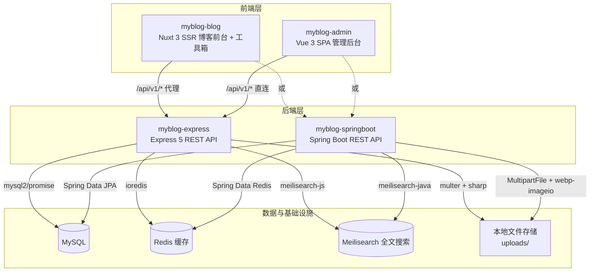

# MyBlog — 全栈博客系统

一个基于 **Node.js / Java + Nuxt 3 + Vue 3** 的全栈个人博客系统，包含博客前台展示、后台内容管理、在线编程工具箱、留言板、表情包、数据备份与前端错误监控等能力。

> 后端提供 **Express (Node.js)** 与 **Spring Boot (Java)** 两种实现，REST API 与行为已按同一份契约对齐，可按技术栈偏好选择部署（仍存在的差异见 [双后端差异](#双后端差异)）。当前已迭代至「精细化体验期」，含 PWA、ISR、骨架屏、错误边界、灯箱预览、主题色体系、移动端深度适配等工程化特性。

---

## 项目架构



| 项目                      | 定位                     | 端口(默认)      | 框架          |
| ------------------------- | ------------------------ | --------------- | ------------- |
| `myblog-express`          | REST API 后端 (Node)     | `3000`          | Express 5     |
| `myblog-springboot`       | REST API 后端 (Java)     | `3000`          | Spring Boot 4 |
| `myblog-vue/myblog-blog`  | 博客前台 + 工具箱(SSR/PWA) | `3001`        | Nuxt 3        |
| `myblog-vue/myblog-admin` | 后台管理系统 (SPA)       | `5173` / `3002` | Vue 3 + Vite |

---

## 技术栈

- **后端 (Express)**: Node.js 20.19+、Express 5、MySQL (mysql2)、Redis (ioredis)、JWT + bcryptjs、Helmet + CORS + 限流、multer + sharp (WebP/缩略图)、Meilisearch、nodemailer、winston + morgan、vitest + supertest (详见 [myblog-express/README.md](./myblog-express/README.md))
- **后端 (Spring Boot)**: JDK 17+、Spring Boot 4、Spring Security + JWT (jjwt)、JPA、Redis、webp-imageio、Meilisearch、Actuator + Micrometer、Jakarta Validation (详见 [myblog-springboot/README.md](./myblog-springboot/README.md))
- **博客前台**: Nuxt 3 + TypeScript、Element Plus、Pinia、markdown-it + highlight.js、dayjs、`@nuxt/image`、`@vite-pwa/nuxt`、Vitest (详见 [myblog-blog/README.md](./myblog-vue/myblog-blog/README.md))
- **管理后台**: Vue 3 + Vite、Pinia、Element Plus、Axios、Vue Quill、ECharts 6、markdown-it、vue-tsc (详见 [myblog-admin/README.md](./myblog-vue/myblog-admin/README.md))

---

## 功能亮点

### 博客前台
- **路由/渲染**：`/` 欢迎落地页（SSR）、`/home` 主站（ISR 60s）、归档/分类/标签 ISR、关于页 SWR、工具箱纯客户端渲染
- **文章体验**：上一篇/下一篇 + 相关推荐、目录导航、阅读进度、正文图片**灯箱预览**、**字号/行距调节**、代码块一键复制 + 行号 + 高亮
- **页面**：首页（公告栏 + 博主信息卡 + 3/2/1 列网格）、文章、分类、标签、归档（搜索/筛选/排序）、关于（个人品牌墙）、友链 `/friends`、留言板、工具箱、404
- **检索**：全站命令面板（`Ctrl/Cmd + K` 唤起，走 Meilisearch 全文检索，不可用时降级为模糊匹配）
- **工具箱**：编解码/格式化/哈希加密/文本处理/颜色工具/开发辅助，含历史快照、收藏、防抖、复制反馈
- **视觉**：主题色体系（后台可切换、按维度/亮暗独立）、暗色模式、滚动入场动画（`v-reveal`）、页面/布局 fade+blur 过渡、移动端 Mobile-First 适配
- **性能/体验**：响应式图片 + LCP 优化、骨架屏、全局错误边界、PWA、SEO（titleTemplate/OG/Twitter/canonical/JSON-LD）、robots + sitemap + RSS

### 管理后台
- 文章（富文本/Markdown 实时预览、草稿/发布、封面）、分类、标签、友链、评论、留言板、表情包管理
- 仪表盘（核心数据、ECharts 趋势图、阅读排行、运维监控）；系统设置（分组表单、自定义 Key-Value、主题色管理）
- **错误监控**（前端聚合错误日志查看/清空）；缓存运维（命中率/清空/预热）；未读红点轮询；博主资料/密码

### 后端（双实现对齐）
REST API（`/api/v1`，统一 `{ code, message, data }`）、JWT + 角色、四层限流、Redis 缓存（预热/统计/失效）、Meilisearch 全文搜索（不可用降级）、图片 WebP/缩略图、邮件通知（无 SMTP 自动停用）、**前端错误上报落库**、指标监控

### 可观测与运维
- **前端错误监控**：前端捕获 → `POST /error-log` 上报 → 后端落库 → 后台回溯（前端节流 + 后端限流防刷）
- **数据备份闭环**：`backup → sha256 校验 → 立即校验 → 可恢复`，支持 cron 定时、手动、恢复演练
- 健康检查 `/health`、性能指标 `/metrics`、Actuator（Spring Boot）

---

## 项目结构

```
myblog-express/                  # 后端 — Express (Node.js)
├── config/                      # 数据库 / JWT / 上传 / 日志 / Redis 配置
├── controllers/                 # 控制器（含 emoji / error-log / message-board）
├── middleware/                  # 认证 / 角色 / 限流 / 缓存 / 校验 / 错误处理 / 性能监控
├── models/                      # 数据模型（ClientErrorLog / Emoji / MessageBoard ...）
├── routes/                      # 路由（含 cache / metrics / emoji / error-log 运维接口）
├── scripts/                     # 运维 / 迁移脚本（clearCache / verifyUploads / auditData / syncMeili ...）
├── services/                    # meilisearch / mailer / commentNotifier
├── test/                        # 集成测试（vitest + supertest）
├── uploads/                     # 上传文件目录
├── Dockerfile
├── .env.example
└── package.json

myblog-springboot/               # 后端 — Spring Boot (Java)
├── Dockerfile                   # 多阶段 Maven 构建
├── pom.xml
└── src/main/
    ├── java/com/myblog/myblogspringboot/
    │   ├── config/              # Security / CORS / 限流 / 缓存统计 / 初始化
    │   ├── controller/          # REST API（含 cache / emoji / message-board）
    │   ├── dto/ / entity/ / exception/ / repository/
    │   ├── security/            # JWT Token 认证
    │   └── service/             # 业务逻辑（含 Mail / 评论通知 / 缓存统计）
    └── resources/application.yml

myblog-vue/
├── myblog-blog/                 # 博客前台（Nuxt 3 SSR + PWA）
│   ├── Dockerfile
│   ├── api/                     # API 封装
│   ├── assets/css/              # 设计 Token（variables/mixins/functions）+ 全局样式
│   ├── components/              # common / layout / tools
│   ├── composables/             # SEO / TOC / 主题色 / 表情 / 工具
│   ├── config/tools.ts          # 工具箱元数据
│   ├── layouts/                 # 布局（含 landing 落地布局）
│   ├── locales/                 # i18n（zh / en）
│   ├── pages/                   # 页面与约定式路由
│   ├── plugins/                 # Element Plus / error-boundary / scroll-reveal
│   ├── server/                  # Nitro（api/v1 代理 + uploads 代理 + robots/rss/sitemap）
│   ├── stores/                  # Pinia（设置 / 博主 / 主题）
│   ├── types/                   # TypeScript 类型
│   ├── utils/                   # markdown / 图片 URL 归一化 / seo / gravatar ...
│   └── nuxt.config.ts
└── myblog-admin/                # 后台管理（Vue 3 SPA + Nginx）
    ├── Dockerfile + nginx.conf
    └── src/
        ├── assets/css/          # 设计令牌 + Element Plus 暗色覆盖
        └── api/ / layouts/ / router/ / stores/ / types/ / utils/ / views/

deploy/k8s/                      # Kubernetes 部署清单（可选）
scripts/                         # backup.sh / restore.sh / verify-backup.sh / backup.Dockerfile
docker-compose.yml               # 一键编排（7 服务）
.env.docker.example              # Docker 环境变量模板
DEPLOY.md                        # Docker 部署详细指南
README.md
```

---

## 快速开始（本地开发）

### 前提条件
- **Express 后端**: Node.js >= 20.19
- **Spring Boot 后端**: JDK 17+、Maven 3.8+
- MySQL >= 8.0、Redis >= 6.0（可选，不部署则缓存自动降级）

### 1. 初始化数据库

```bash
mysql -u root -p -e "CREATE DATABASE myblog CHARACTER SET utf8mb4 COLLATE utf8mb4_unicode_ci;"
mysql -u root -p myblog < myblog-express/myblog-1.1.sql
```

### 2. 启动后端（二选一）

#### 方式 A：Express

```bash
cd myblog-express
cp .env.example .env      # 修改 DB_PASSWORD 与 JWT_SECRET（生产必改）
npm install
npm run dev               # http://localhost:3000
npm run init-blogger      # （可选）初始化默认博主 admin / admin123
```

#### 方式 B：Spring Boot

```bash
cd myblog-springboot
# 通过环境变量注入 DB_HOST/DB_USER/DB_PASSWORD/DB_NAME/JWT_SECRET
# 或编辑 src/main/resources/application.yml
./mvnw spring-boot:run     # http://localhost:3000
```

> 首次启动自动创建默认博主（`admin` / `admin123`），请及时修改默认密码。

### 3. 启动博客前台

```bash
cd myblog-vue/myblog-blog
npm install
npm run dev               # http://localhost:3001
```

> 开发服务器监听 `0.0.0.0`，同一 WiFi 下手机可通过 `http://<电脑IP>:3001` 访问；图片/API 经 Nuxt 代理转发，手机端无需额外配置。

### 4. 启动管理后台

```bash
cd myblog-vue/myblog-admin
cp .env.example .env
npm install
npm run dev               # http://localhost:5173
```

> 开发环境 API 走 Vite 代理（相对路径 `/api/v1` → 本机 `3000`）。

---

## 环境变量

各子项目均有 `.env.example` 模板，复制为 `.env` 即可使用。**生产必改** `JWT_SECRET` 与数据库密码。

> ⚠️ **两种后端不能共用同一份 `.env`**：`JWT_EXPIRES_IN` 在 Express 是**时长字符串**（如 `7d`），在 Spring Boot 是**毫秒数**（如 `604800000`）——把 Express 的 `.env` 直接喂给 Spring 会启动失败（`Failed to convert value of type 'java.lang.String' to required type 'long'`）。其余变量名一致。

- **Express**: 见 [myblog-express/README.md](./myblog-express/README.md)（`NODE_ENV`/`PORT`/`DB_*`/`DB_TIME_ZONE`/`JWT_*`/`REDIS_*`/`MEILI_*`/`SMTP_*`/`FRONTEND_ORIGIN`/`ADMIN_ORIGIN`/`TRUST_PROXY` 等）
- **Spring Boot**: 见 [myblog-springboot/README.md](./myblog-springboot/README.md)（`DB_*`/`APP_TIME_ZONE`/`JWT_*`/`MEILI_*`/`REDIS_*`/`UPLOAD_PATH` 等）
- **博客前台**: `NUXT_API_BASE`、`NUXT_SITE_URL`
- **管理后台**: `VITE_API_BASE`
- **Docker 部署**: 见 [.env.docker.example](./.env.docker.example) 与 [DEPLOY.md](./DEPLOY.md)

### 时间字段与时区

数据库 `datetime` 列存的是**无时区的墙钟字面量**。两端都把它按「写入端时区」解释后输出 **UTC 瞬时串**（`2026-09-13T11:10:49.000Z`，毫秒固定 3 位）：

| 环节 | 配置项 | 取值格式 |
| --- | --- | --- |
| MySQL 写入端（`NOW()` / `CURRENT_TIMESTAMP`） | `docker-compose.yml` 中 `mysql` 服务的 `TZ` | IANA 名称（`Asia/Shanghai`） |
| Express 读 → JSON（`config/database.js`） | `DB_TIME_ZONE` | **固定偏移**（`+08:00` / `Z`；mysql2 不支持 IANA 名称） |
| Spring Boot 读 → JSON（`config/JacksonConfig.java`） | `APP_TIME_ZONE` | IANA 名称（`Asia/Shanghai`） |
| 博客前台 SSR 直出时间 | `docker-compose.yml` 中 `myblog-blog` 服务的 `TZ` | IANA 名称（`Asia/Shanghai`） |

> ⚠️ **四项必须表示同一时区**。不匹配时**不会报错**，只会让时间字段整体偏移（典型 8 小时）——Express 启动时会自检并在控制台打印告警。
> ⚠️ **前台容器的 `TZ` 不能省**：`utils/format.ts` 用 dayjs 按**运行时时区**展开带 `Z` 的串，容器保持 UTC 会让 SSR 直出的时间与浏览器水合的北京时间不一致（跨天时表现为 hydration mismatch）。管理后台是纯静态 SPA，时间由浏览器时区渲染，不需要设。
> ⚠️ 若把数据库改成 **UTC 存储**，`DB_TIME_ZONE` 与 `APP_TIME_ZONE` 必须同步改为 `+00:00` / `UTC`。

---

## Redis 缓存策略

| 特性          | 说明                                                                 |
| ------------- | -------------------------------------------------------------------- |
| 缓存对象      | 仅缓存 GET 请求的 JSON 响应                                          |
| 缓存键        | `cache:{prefix}:{路由}[:{queryString}]`（Spring Boot 为 `分区名::key`） |
| 默认 TTL      | 300 秒（5 分钟）                                                     |
| Cache-Control | 按接口分档下发：settings `max-age=300`，types/labels/friend-links `max-age=600`（均带 `stale-while-revalidate`，双端一致） |
| 命中统计      | 进程内记录 hits/misses，`GET /api/v1/cache/stats` 查看命中率         |
| 缓存预热      | 启动时自动预取 settings/types/labels，后台可手动触发                 |
| 一键清空      | `POST /api/v1/cache/clear`（管理后台"运维监控"页）                   |
| 降级策略      | Redis 不可用时自动跳过缓存，直查数据库（Spring Boot 降级为内存缓存） |
| 写失效        | POST/PUT/DELETE 操作可调用 `cache.invalidate(prefix)` 主动清除       |

---

## API 接口

> 前缀 `/api/v1`，统一响应 `{ code, message, data }`。

| 方法                  | 路径                                           | 说明                         | 认证     |
| --------------------- | ---------------------------------------------- | ---------------------------- | -------- |
| `GET`                 | `/health`                                      | 健康检查（DB/Redis/Meili）   | 否       |
| `POST`                | `/blogger/login`                               | 博主登录                     | 否       |
| `GET`                 | `/blogger/public-profile`                      | 博主公开信息                 | 否       |
| `GET/POST`            | `/articles`                                    | 文章列表 / 创建              | 读写分离 |
| `GET/PUT/DELETE`      | `/articles/:id`                                | 文章详情 / 更新 / 软删除     | —        |
| `GET`                 | `/articles/:id/related`                        | 相关推荐（按共享标签评分）   | 否       |
| `GET`                 | `/articles/:id/adjacent`                       | 上一篇 / 下一篇              | 否       |
| `GET`                 | `/articles/trash`                              | 回收站列表                   | admin    |
| `PUT`                 | `/articles/batch/status`                       | 批量发布 / 下架              | admin    |
| `GET`                 | `/search`                                      | 全文搜索（Meili，降级 LIKE） | 否       |
| `GET/POST`            | `/comments`                                    | 评论列表 / 发布              | 否       |
| `PUT/DELETE`          | `/comments/:id/...`                            | 审核 / 删除 / 点赞 / 恢复    | 混合     |
| `GET/POST`            | `/message-board`                               | 留言板                       | 读公开   |
| `GET/POST/PUT/DELETE` | `/emoji`                                       | 表情包 CRUD                  | admin    |
| `GET/POST/PUT/DELETE` | `/emoji-groups`                                | 表情包分组 CRUD              | admin    |
| `GET/POST/PUT/DELETE` | `/types` `/labels`                             | 分类 / 标签 CRUD             | —        |
| `GET/POST/PUT/DELETE` | `/friend-links`                                | 友链 CRUD（GET 仅启用）      | 读公开   |
| `POST`                | `/friend-links/:id/click`                      | 友链点击计数                 | 否       |
| `GET/PUT/DELETE`      | `/settings` `/settings/:key`                   | 网站配置读写                 | 读公开   |
| `POST`                | `/upload/image`                                | 上传图片（自动生成 WebP）    | admin    |
| `GET`                 | `/dashboard/stats` `/dashboard/charts`         | 仪表盘 / 图表 / 未读红点     | admin    |
| `GET/POST`            | `/cache/stats` `/cache/clear` `/cache/preheat` | 缓存运维（命中率/清空/预热） | admin    |
| `GET`                 | `/metrics`                                     | 性能监控（响应时间/错误率）  | admin    |
| `POST`                | `/error-log`                                   | 前端错误上报（公开）         | 否（限流） |
| `GET/DELETE`          | `/error-log`                                   | 错误日志列表 / 清空          | admin    |

---

## 双后端差异

两种后端共用同一份数据库（Spring Boot `ddl-auto: none`），REST 路径、统一响应 `{ code, message, data }`、时间字段 JSON 格式（UTC 瞬时串，见[时间字段与时区](#时间字段与时区)）与缓存 / 限流口径已对齐；以下是仍然存在或有意保留的差异：

| 维度 | Express | Spring Boot | 说明 |
| --- | --- | --- | --- |
| 运维脚本 | `myblog-express/scripts/` 下 11 个（清缓存 / 数据体检 / 文件体检 / 回填索引 / 状态迁移 …） | 无 | 脚本直连同一份 MySQL / Redis，不依赖后端进程；用 Spring 部署时仍可在 `myblog-express/` 目录下执行 |
| `.env` | `JWT_EXPIRES_IN=7d`（时长字符串） | `JWT_EXPIRES_IN=604800000`（毫秒） | **两端不能共用同一份 `.env`** |
| 可观测 | 自研 `/metrics` + winston 日志 | 额外提供 Actuator + Micrometer（`/actuator/health`、`/actuator/prometheus`） | Spring 侧增量，非缺口 |
| 缓存降级 | Redis 不可用时直查数据库 | Redis 不可用时降级为内存缓存 | 行为差异，不影响接口契约 |

---

## 数据库

| 表                  | 说明                                     |
| ------------------- | ---------------------------------------- |
| `article`           | 文章（软删除）                           |
| `article_label`     | 文章-标签关联                            |
| `blogger`           | 博主                                     |
| `comment`           | 评论（访客：昵称/邮箱/网址）             |
| `message_board`     | 留言板                                   |
| `emoji`             | 博主自定义表情包                         |
| `emoji_group`       | 表情包分组（名称 / 标识 / 排序）         |
| `friend_link`       | 友情链接（头像/简介/邮箱/置顶/点击统计） |
| `label`             | 标签                                     |
| `setting`           | 网站配置                                 |
| `type`              | 分类                                     |
| `client_error_log`  | 前端错误监控日志                         |

---

## 测试

```bash
# Express 后端集成测试
cd myblog-express && npm test

# Spring Boot 后端测试
cd myblog-springboot && ./mvnw test

# 博客前台工具箱/单测
cd myblog-vue/myblog-blog && npm test
```

---

## 部署

> **推荐使用 Docker Compose 一键部署**，7 个容器（MySQL + Redis + Meilisearch + 后端 + 博客 + 管理后台 + 定时备份）自动编排。

### Docker 部署（推荐）

```bash
# 1. 配置环境变量
cp .env.docker.example .env.docker
# 编辑 .env.docker，修改 DB_PASSWORD 和 JWT_SECRET

# 2. 一键构建并启动
docker compose --env-file .env.docker up -d --build

# 3. 访问
#   博客前台: http://localhost:3001
#   管理后台: http://localhost:3002
#   API 接口: http://localhost:3000/api/v1
#   Meilisearch: http://localhost:7700
```

详细说明（环境变量、后端切换 Spring Boot、数据备份/校验/恢复、生产建议、故障排查）请参阅 **[DEPLOY.md](./DEPLOY.md)**。

### 手动部署

```bash
# Express 后端
cd myblog-express && NODE_ENV=production npm start

# Spring Boot 后端
cd myblog-springboot && ./mvnw package -DskipTests
java -jar target/myblog-springboot-0.0.1-SNAPSHOT.jar

# 博客前台（Nuxt SSR 产物为 .output/，Node 服务方式运行）
cd myblog-vue/myblog-blog && npm run build
node .output/server/index.mjs

# 管理后台
cd myblog-vue/myblog-admin && npm run build   # → dist/
```

---

## 版本记录

| 日期       | 版本 | 说明                                                                                                                                                                                                                                                                         |
| ---------- | ---- | ---------------------------------------------------------------------------------------------------------------------------------------------------------------------------------------------------------------------------------------------------------------------------- |
| 2026-09-14 | v2.7 | **双端对齐与体验修补**：Spring Boot 修复按文档启不来与文章列表/详情 500，补齐相关推荐、上下篇、批量改状态、错误日志、性能指标等缺失接口并统一缓存头与限流口径；相关文章改为按共同标签展示；修复评论输入框首字符被插到 contenteditable 根层引发的计数器与输入法异常；全站搜索命令面板（Meilisearch）；表情包分组体系重做；文章内容格式（富文本/Markdown）双端落地；站点功能开关与全站维护页；标签/分类禁止重名；后台下拉检索与 Markdown 编辑区等高；数据层体检与上传文件体检脚本 |
| 2026-09-06 | v2.6 | **双端对齐与可观测**：Spring Boot 同步表情管理 + 后台未读红点（补齐双端能力）；文章正文图片灯箱预览；前端错误监控上报接入（自建轻量聚合：前端捕获→`/error-log` 落库→后台回溯，前后端双限流） |
| 2026-08-31 | v2.5 | **内容消费与体验增强**：前台移动端 Mobile-First 深度重构；文章阅读体验（字号/行距 + 代码块复制行号）；上一篇/下一篇 + 相关推荐；关于页重构为个人品牌墙；全局骨架屏与错误边界；数据自动备份 + 校验和 + 一键恢复闭环；留言板；博主自定义表情包；主题色体系；归档页搜索/筛选/排序；图片响应式与 LCP 优化；滚动入场动画 |
| 2026-08-22 | v2.4 | **首页改版与路由拆分**：首页秩序化网格重构（3/2/1 列网格 + 公告栏 + 博主信息卡）；友情链接体系（`/friends` 独立页 + 友链表 + 双端接口 + 后台管理）；路由重构（`/` 欢迎落地页 + `/home` 主站）；主题色亮/暗分离；settings 支持自定义 Key-Value；修复 Nuxt 前台 Docker 构建 |
| 2026-08-04 | v2.3 | **设计系统统一与全面重构**：前后台视觉升级、系统设置分组化、工具箱收藏、评论 @提及与邮件通知、缓存预热与统计、图片 WebP 落地、Spring Boot 功能对齐 |
| 2026-06-27 | v2.2 | **容器化部署支持**：docker-compose.yml + 多份 Dockerfile + DEPLOY.md，一键编排后端/博客/后台/MySQL/Redis |
| 2026-06-10 | v2.1 | **双后端实现**：新增 Spring Boot 后端（myblog-springboot），与 Express 功能等价，可按技术栈偏好选择 |
| 2026-06-08 | v2.0 | **基线重构**：访客评论增强、暗色主题、SEO 优化、代码分隔、类型统一、测试/CI/CD 基础设施 |

---

## 相关文档

- [DEPLOY.md](./DEPLOY.md) — Docker 一键部署指南
- 各子项目 README：· [Express](./myblog-express/README.md) · [Spring Boot](./myblog-springboot/README.md) · [博客前台](./myblog-vue/myblog-blog/README.md) · [管理后台](./myblog-vue/myblog-admin/README.md)

> 设计规范、评估报告与变更日志属本地文档，未纳入版本库（`.gitignore` 排除 `documents/`）。
