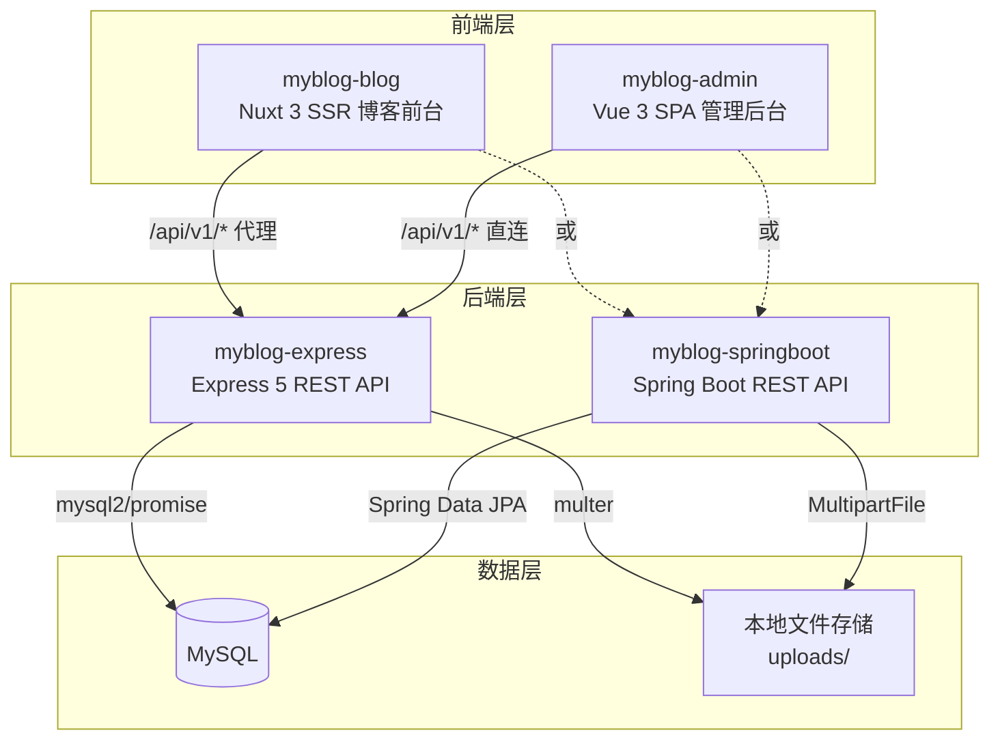

# MyBlog — 全栈博客系统

一个基于 **Node.js + Express / Spring Boot + Nuxt 3 + Vue 3** 的全栈个人博客系统，包含博客前台展示、后台内容管理、在线编程工具箱三大模块。

> 后端提供 **Express (Node.js)** 和 **Spring Boot (Java)** 两种实现，功能完全等价，可按技术栈偏好选择部署。

---

## 🌟 亮点速览

| 维度                   | 亮点                                                                                              |
| ---------------------- | ------------------------------------------------------------------------------------------------- |
| 🏗️ **双引擎后端**      | Express 与 Spring Boot 功能等价、可无缝切换                                                       |
| 🔒 **多层安全防护**    | CSP 策略 + 四层限流（全局/登录/评论/上传）+ CORS 白名单 + 生产密码强制校验                        |
| ⚡ **智能缓存**        | Redis stale-while-revalidate + 命中率统计 + 启动/手动预热 + 一键清空，不可用时自动降级直查数据库  |
| 🌓 **暗色模式**        | 博客前台 + 管理后台均支持，CSS 变量驱动，跟随系统 / 手动切换，Element Plus 全组件适配             |
| 🧰 **内置工具箱**      | 15+ 编程工具，Web Worker 计算，支持一键收藏，不影响页面交互                                       |
| 📝 **访客评论系统**    | Gravatar 头像（国内镜像）、嵌套回复、@提及、点赞、审核/垃圾标记、邮件通知                         |
| ⚙️ **系统设置可视化**  | 分组表单配置（基本/外观/社交），含校验与 JSON 导出/导入，保存即生效                               |
| 🧷 **友情链接管理**    | 独立友链页（/friends）+ 后台持续增改删，支持头像/简介/置顶/点击统计（Express & Spring Boot 对齐） |
| 🎨 **首页 Bento 布局** | 文章卡 + 热门卡并排等高、最新徽标、响应式每行 3/2 张，主题色亮/暗分离                             |
| 📈 **运维监控**        | 缓存命中率、响应时间、错误率、慢请求追踪，后台一键查看与清空                                      |
| 📱 **局域网联调**      | 开发服务器监听 0.0.0.0，同 WiFi 手机即可访问测试                                                  |
| 🐳 **Docker 一键部署** | 5 容器自动编排，含健康检查、数据持久化、自动库表初始化                                            |

---

## 📋 目录

- [项目架构](#项目架构)
- [亮点速览](#-亮点速览)
- [技术栈](#技术栈)
- [项目结构](#项目结构)
- [功能特性](#功能特性)
- [快速开始](#快速开始)
- [环境变量](#环境变量)
- [安全设计](#安全设计)
- [Redis 缓存策略](#redis-缓存策略)
- [API 接口](#api-接口)
- [暗色模式与主题](#暗色模式与主题)
- [SEO 实现](#seo-实现)
- [工具箱](#工具箱)
- [数据库](#数据库)
- [测试](#测试)
- [CI/CD](#cicd)
- [部署](#部署)
  - [Docker 部署（推荐）](#docker-部署推荐)
  - [手动部署](#手动部署)
- [版本记录](#版本记录)

---

## 项目架构



| 项目                      | 定位                     | 端口      | 框架          |
| ------------------------- | ------------------------ | --------- | ------------- |
| `myblog-express`          | REST API 后端服务 (Node) | `3000`    | Express 5     |
| `myblog-springboot`       | REST API 后端服务 (Java) | `3000`    | Spring Boot 4 |
| `myblog-vue/myblog-blog`  | 博客前台 + 工具箱（SSR） | `3001`    | Nuxt 3        |
| `myblog-vue/myblog-admin` | 后台管理系统（SPA）      | Vite 默认 | Vue 3 + Vite  |

---

## 技术栈

### 后端 — Express (`myblog-express`)

| 类别       | 方案                          | 版本            |
| ---------- | ----------------------------- | --------------- |
| 运行时     | Node.js                       | —               |
| Web 框架   | Express                       | ^5.2.1          |
| 数据库     | MySQL                         | —               |
| 数据库驱动 | mysql2/promise                | ^3.20.0         |
| 缓存       | Redis (ioredis)               | ^5.11.1         |
| 认证       | JWT (jsonwebtoken + bcryptjs) | ^9.0.3 / ^3.0.3 |
| 文件上传   | multer                        | ^2.1.1          |
| 图片处理   | sharp (WebP/缩略图)           | ^0.33.0         |
| 全文搜索   | meilisearch                   | ^0.48.0         |
| 邮件通知   | nodemailer                    | ^6.10.1         |
| 安全       | helmet + cors                 | ^8.1.0 / ^2.8.6 |
| 限流       | express-rate-limit            | ^8.5.2          |
| 压缩       | compression                   | ^1.8.1          |
| HTTP 日志  | morgan                        | ^1.10.1         |
| 结构化日志 | winston                       | ^3.19.0         |
| 参数校验   | express-validator             | ^7.3.1          |
| 测试       | vitest + supertest            | ^3.2.4 / ^7.2.0 |

### 后端 — Spring Boot (`myblog-springboot`)

| 类别       | 方案                                      | 版本   |
| ---------- | ----------------------------------------- | ------ |
| 运行时     | Java / JDK                                | 17+    |
| Web 框架   | Spring Boot                               | 4.0.6  |
| ORM        | Spring Data JPA / Hibernate               | —      |
| 数据库     | MySQL                                     | —      |
| 数据库驱动 | mysql-connector-j                         | —      |
| 认证       | JWT (jjwt) + Spring Security              | 0.12.6 |
| 密码加密   | BCrypt (Spring Security)                  | —      |
| 文件上传   | Spring MultipartFile                      | —      |
| 图片处理   | webp-imageio (WebP 变体)                  | 0.1.6  |
| 邮件通知   | spring-boot-starter-mail                  | —      |
| 缓存       | spring-boot-starter-data-redis + 内存降级 | —      |
| 监控       | Actuator + Micrometer/Prometheus          | —      |
| 跨域       | Spring WebMvcConfigurer                   | —      |
| 参数校验   | Jakarta Validation                        | —      |
| 测试       | Spring Boot Test                          | —      |

### 博客前台 (`myblog-blog`)

| 类别      | 方案                            | 版本    |
| --------- | ------------------------------- | ------- |
| 框架      | Nuxt 3                          | ^3.17.7 |
| 语言      | TypeScript                      | —       |
| UI 组件库 | Element Plus（按需导入）        | ^2.13.6 |
| 图片优化  | @nuxt/image (WebP / 响应式尺寸) | ^1.11.0 |
| 状态管理  | Pinia                           | —       |
| Markdown  | markdown-it                     | ^14.1.0 |
| 代码高亮  | highlight.js（按需加载）        | ^11.9.0 |
| 日期处理  | dayjs                           | —       |
| 工具计算  | Web Worker                      | —       |
| 测试      | vitest                          | ^3.2.4  |

### 管理后台 (`myblog-admin`)

| 类别        | 方案             | 版本    |
| ----------- | ---------------- | ------- |
| 框架        | Vue 3            | ^3.5.30 |
| 构建        | Vite             | ^7.3.1  |
| 路由        | Vue Router       | ^5.0.3  |
| 状态管理    | Pinia            | ^3.0.4  |
| UI 组件库   | Element Plus     | ^2.13.6 |
| HTTP 客户端 | Axios            | ^1.13.6 |
| 富文本编辑  | @vueup/vue-quill | ^1.2.0  |
| 图表        | ECharts          | ^6.0.0  |

---

## 项目结构

```
myblog-express/                  # 后端 — Express (Node.js)
├── config/                      # 配置（数据库、JWT、上传、日志、Redis）
├── controllers/                 # 控制器
├── middleware/                  # 中间件（认证、角色、限流、缓存、校验、错误处理、性能监控）
├── models/                      # 数据模型
├── routes/                      # 路由（含 cache/metrics 运维接口）
├── scripts/                     # 初始化脚本
├── services/                    # 服务（meilisearch、mailer、commentNotifier）
├── test/                        # 集成测试
├── uploads/                     # 上传文件目录
├── Dockerfile                   # Docker 镜像
├── .env.example                 # 环境变量模板
└── package.json

myblog-springboot/               # 后端 — Spring Boot (Java)
├── Dockerfile                   # Docker 镜像（多阶段 Maven 构建）
├── pom.xml                      # Maven 依赖配置
└── src/main/
    ├── java/com/myblog/myblogspringboot/
    │   ├── config/              # 配置（Security、CORS、缓存统计拦截器、初始化）
    │   ├── controller/          # 控制器（REST API，含 cache 运维接口）
    │   ├── dto/                 # 请求/响应 DTO
    │   ├── entity/              # JPA 实体（Article、Comment 等）
    │   ├── exception/           # 全局异常处理
    │   ├── repository/          # Spring Data JPA Repository
    │   ├── security/            # JWT Token 认证
    │   └── service/             # 业务逻辑层（含 Mail/评论通知/缓存统计）
    └── resources/
        └── application.yml      # 应用配置

myblog-vue/
├── myblog-blog/                 # 博客前台（Nuxt 3 SSR）
│   ├── Dockerfile               # Docker 镜像（SSR 构建 + 运行）
│   ├── api/                     # API 封装
│   ├── assets/css/              # 全局样式与 CSS 变量
│   ├── components/              # 组件（common / layout / tools）
│   ├── composables/             # 组合式函数（SEO、JSON-LD、i18n、工具）
│   ├── layouts/                 # 布局
│   ├── locales/                 # i18n 词条（zh / en）
│   ├── pages/                   # 页面
│   ├── plugins/                 # Element Plus 插件
│   ├── server/                  # Nitro（API 代理、sitemap、/uploads 代理）
│   ├── stores/                  # Pinia（设置、博主、主题）
│   ├── types/                   # TypeScript 类型
│   └── utils/                   # 工具函数、格式、SEO、Gravatar、图片 URL 归一化
│
└── myblog-admin/                # 后台管理（Vue 3 SPA）
    ├── Dockerfile               # Docker 镜像（构建 + Nginx）
    ├── src/
    │   ├── assets/css/          # 设计令牌 + Element Plus 暗色覆盖
    │   └── api/ / layouts/ / router/ / stores/ / types/ / utils/ / views/
    ├── nginx.conf                # Nginx 配置（SPA 路由）
    └── package.json
├── docker-compose.yml              # Docker Compose 编排（一键部署）
├── .env.docker.example             # Docker 环境变量模板
├── DEPLOY.md                       # Docker 部署详细指南
└── README.md
```

---

## 功能特性

### 博客前台

- **文章展示**：Markdown 渲染 + highlight.js 按需加载代码高亮（暗色模式自动切换主题）
- **首页 Bento 布局**：文章卡 + 热门卡并排等高；第一篇文章封面左上角「最新」角标；热门按浏览量单独拉取、>1280 两栏 12 篇；响应式每行 3/2 张
- **文章卡片**：封面 WebP 主图（高清）+ hover 缩放、阅读时长、摘要截断
- **阅读体验**：顶部阅读进度条 + 目录滚动高亮
- **访客评论**：昵称 + 邮箱 + 网址，Gravatar 头像（cravatar.cn 国内镜像）
- **评论嵌套**：@提及自动填充与高亮、嵌套连线、点赞、待审核机制
- **分类 / 标签**：归档页时间线布局（年份徽章 + 月份节点）+ 汇总卡片
- **友情链接**：独立 `/friends` 页（卡片网格 + 头像字母 + 域名展示），导航直达
- **搜索**：全文关键词（Meilisearch，不可用自动降级）+ 相关度排序 + 高亮
- **SEO**：Open Graph / Twitter Card / JSON-LD 结构化数据（BlogPosting + WebSite） / sitemap.xml / Canonical URL / 自定义 404 页面
- **暗色模式**：一键切换 + 跟随系统 + CSS 变量 + Element Plus 自动适配
- **自定义背景**：明/暗各自独立背景图（后台配置）
- **毛玻璃效果**：所有卡片半透明 + `backdrop-filter: blur`
- **编程工具箱**：Base64、URL、JSON、SQL、MD5、时间戳等 15+ 工具（Web Worker + 一键收藏）
- **i18n 预备**：中/英词条 + `useI18n()` composable

### 管理后台

- **仪表盘**：图标化统计卡片（文章/评论/浏览/待审核）+ 发布趋势图（ECharts，随主题重绘）+ 阅读排行
- **文章管理**：Quill 富文本、草稿/发布、软删除/恢复回收站、localStorage 草稿自动保存、实时预览、一键生成摘要
- **分类 / 标签**：CRUD
- **友链管理**：表格 + 增删改，支持头像上传、简介、站长邮箱、置顶/启用开关、点击统计
- **评论管理**：审核/垃圾/删除/回收站，网站列
- **系统设置**：分组表单（基本/外观/社交），含校验、保存即生效、JSON 导出/导入
- **运维监控**：缓存命中率、平均/最大响应时间、错误率、慢请求追踪，一键清空缓存与预热
- **暗色模式**：顶栏一键切换，持久化 + 跟随系统
- **博主管理**：资料、头像、密码修改

---

## 快速开始

### 前提条件

- **Express 后端**：Node.js >= 20.19
- **Spring Boot 后端**：JDK 17+、Maven 3.8+
- MySQL >= 8.0
- Redis >= 6.0（可选，不部署则缓存功能自动降级）

### 1. 初始化数据库

```bash
mysql -u root -p -e "CREATE DATABASE myblog CHARACTER SET utf8mb4 COLLATE utf8mb4_unicode_ci;"
mysql -u root -p myblog < myblog-express/myblog-1.1.sql
```

### 2. 启动后端（二选一）

#### 方式 A：Express（Node.js）

```bash
cd myblog-express
cp .env.example .env   # 编辑数据库密码和 JWT_SECRET
npm install
npm run dev             # http://localhost:3000
```

#### 方式 B：Spring Boot（Java）

```bash
cd myblog-springboot
# 编辑 src/main/resources/application.yml 中的数据库连接信息
# 或通过环境变量设置: DB_HOST, DB_USER, DB_PASSWORD, DB_NAME, JWT_SECRET
./mvnw spring-boot:run    # http://localhost:3000
```

> 首次启动自动创建默认博主（admin / admin123），请及时修改默认密码。

### 3. 启动博客前台

```bash
cd myblog-vue/myblog-blog
npm install
npm run dev             # http://localhost:3001
```

> 开发服务器监听 `0.0.0.0`，同一 WiFi 下手机可通过 `http://<电脑IP>:3001` 访问测试；
> 图片/API 经 Nuxt 代理转发，手机端无需额外配置。

### 4. 启动管理后台

```bash
cd myblog-vue/myblog-admin
cp .env.example .env
npm install
npm run dev             # http://localhost:5173
```

> 开发环境 API 走 Vite 代理（相对路径 `/api/v1` 转发到本机 3000），
> 手机通过 `http://<电脑IP>:5173` 访问同样可正常请求接口。

---

## 环境变量

### Express 后端 (`myblog-express/.env`)

| 变量                                                                           | 说明                                  | 默认值                             |
| ------------------------------------------------------------------------------ | ------------------------------------- | ---------------------------------- |
| `NODE_ENV`                                                                     | 运行模式                              | `development`                      |
| `PORT`                                                                         | 服务端口                              | `3000`                             |
| `DB_HOST` / `DB_PORT` / `DB_USER` / `DB_PASSWORD` / `DB_NAME`                  | 数据库连接                            | —                                  |
| **`JWT_SECRET`**                                                               | JWT 密钥（**生产必改**）              | —                                  |
| `JWT_EXPIRES_IN`                                                               | Token 有效期                          | `7d`                               |
| `BLOGGER_USERNAME` / `BLOGGER_PASSWORD` / `BLOGGER_NICKNAME` / `BLOGGER_EMAIL` | 默认博主                              | —                                  |
| `FRONTEND_ORIGIN`                                                              | 前端域名（CORS）                      | `http://localhost:3001`            |
| `TRUST_PROXY`                                                                  | 反向代理信任层级（限流按真实访客 IP） | `1`                                |
| `SITE_URL` / `SITE_NAME`                                                       | 站点链接与名称（邮件通知用）          | `http://localhost:3001` / `MyBlog` |
| `SMTP_HOST` / `SMTP_PORT` / `SMTP_USER` / `SMTP_PASS` / `SMTP_FROM`            | SMTP 邮件通知（可选，未配置自动停用） | —                                  |

### Spring Boot 后端 (`myblog-springboot/src/main/resources/application.yml` / 环境变量)

| 环境变量                                                                       | application.yml 对应路径                   | 说明                                  | 默认值             |
| ------------------------------------------------------------------------------ | ------------------------------------------ | ------------------------------------- | ------------------ |
| `PORT`                                                                         | `server.port`                              | 服务端口                              | `3000`             |
| `DB_HOST` / `DB_PORT` / `DB_USER` / `DB_PASSWORD` / `DB_NAME`                  | `spring.datasource.*`                      | 数据库连接                            | —                  |
| **`JWT_SECRET`**                                                               | `app.jwt.secret`                           | JWT 密钥（**生产必改**）              | —                  |
| `JWT_EXPIRES_IN`                                                               | `app.jwt.expiration-ms`                    | Token 有效期（毫秒）                  | `604800000`（7天） |
| `BLOGGER_USERNAME` / `BLOGGER_PASSWORD` / `BLOGGER_NICKNAME` / `BLOGGER_EMAIL` | `app.blogger.*`                            | 默认博主                              | —                  |
| `FRONTEND_ORIGIN` / `ADMIN_ORIGIN`                                             | `app.frontend-origin` / `app.admin-origin` | CORS 白名单                           | —                  |
| `UPLOAD_PATH`                                                                  | `app.upload.path`                          | 上传文件目录                          | `uploads`          |
| `MEILI_HOST` / `MEILI_PORT` / `MEILI_MASTER_KEY`                               | `app.meilisearch.*`                        | Meilisearch 全文搜索                  | —                  |
| `SITE_URL` / `SITE_NAME`                                                       | `app.site-url` / `app.site-name`           | 站点链接与名称（邮件通知用）          | —                  |
| `SMTP_HOST` / `SMTP_PORT` / `SMTP_USER` / `SMTP_PASS`                          | `spring.mail.*`                            | SMTP 邮件通知（可选，未配置自动停用） | —                  |

### 管理后台 (`myblog-admin/.env`)

| 变量            | 说明          | 默认值                                                        |
| --------------- | ------------- | ------------------------------------------------------------- |
| `VITE_API_BASE` | 后端 API 地址 | `/api/v1`（开发走 Vite 代理；生产由 Dockerfile 注入绝对地址） |

> 各子项目均有 `.env.example` 模板文件，可直接复制为 `.env` 使用。

---

## 安全设计

### 限流策略

Express 后端实现了 **四层速率限制**，全部基于 `express-rate-limit`：

| 层级 | 路由                      | 窗口    | 上限    | 说明                                                               |
| ---- | ------------------------- | ------- | ------- | ------------------------------------------------------------------ |
| 全局 | `/api/*`                  | 15 分钟 | 1200 次 | 按真实访客 IP 独立计数（`trust proxy`），返回标准 `RateLimit-*` 头 |
| 登录 | `/api/v1/blogger/login`   | 15 分钟 | 10 次   | 成功后不计数，防暴力破解                                           |
| 评论 | `/api/v1/comments` (POST) | 15 分钟 | 30 次   | 防评论灌水                                                         |
| 上传 | `/api/v1/upload`          | 15 分钟 | 50 次   | 防止滥用上传接口                                                   |

> 请求经 Nuxt(3001) / Nginx 反代时，后端通过 `X-Forwarded-For` 取真实客户端 IP（`TRUST_PROXY` 配置层级），
> 避免所有访客共享 `127.0.0.1` 配额导致误杀。Spring Boot 端由 `config/RateLimitFilter` 提供等价四层限流。

### 其他安全措施

- **Helmet + CSP**：限制脚本/样式/图片来源，防御 XSS
- **CORS 白名单**：仅允许配置的前端域名跨域访问
- **生产密码强制**：生产环境禁止空密码或 `root` 默认密码
- **JWT Bearer Token**：`auth` 中间件（强制）+ `optionalAuth` 中间件（可选认证，用于公开接口透传用户态）
- **优雅关闭**：监听 SIGTERM/SIGINT，依次关闭 HTTP → 数据库 → Redis
- **健康检查**：`/health` 返回数据库/Redis/Meilisearch 真实探测状态（Spring Boot 另暴露 `/actuator/health` 与 `/actuator/prometheus`）

---

## Redis 缓存策略

| 特性          | 说明                                                                 |
| ------------- | -------------------------------------------------------------------- |
| 缓存对象      | 仅缓存 GET 请求的 JSON 响应                                          |
| 缓存键        | `cache:{prefix}:{queryString}`（Spring Boot 为 `分区名::key`）       |
| 默认 TTL      | 300 秒（5 分钟）                                                     |
| Cache-Control | `public, max-age=300, stale-while-revalidate=600`                    |
| 命中统计      | 进程内记录 hits/misses，`GET /api/v1/cache/stats` 查看命中率         |
| 缓存预热      | 启动时自动预取 settings/types/labels，后台可手动触发                 |
| 一键清空      | `POST /api/v1/cache/clear`（管理后台"运维监控"页）                   |
| 降级策略      | Redis 不可用时自动跳过缓存，直查数据库（Spring Boot 降级为内存缓存） |
| 写失效        | POST/PUT/DELETE 操作可调用 `cache.invalidate(prefix)` 主动清除       |

---

## API 接口

> 前缀 `/api/v1`，统一响应 `{ code, message, data }`。

| 方法                  | 路径                                           | 说明                         | 认证     |
| --------------------- | ---------------------------------------------- | ---------------------------- | -------- |
| `GET`                 | `/health`                                      | 健康检查（DB/Redis/Meili）   | 否       |
| `GET/POST`            | `/articles`                                    | 文章列表 / 创建              | 读写分离 |
| `GET/PUT/DELETE`      | `/articles/:id`                                | 文章详情 / 更新 / 软删除     | —        |
| `GET/POST`            | `/comments`                                    | 评论列表 / 发布              | 否       |
| `PUT/DELETE`          | `/comments/:id/...`                            | 审核 / 删除 / 点赞 / 恢复    | 混合     |
| `POST`                | `/blogger/login`                               | 博主登录                     | 否       |
| `GET`                 | `/blogger/public-profile`                      | 博主公开信息                 | 否       |
| `GET/PUT`             | `/settings`                                    | 网站配置读写                 | 读公开   |
| `GET/POST/PUT/DELETE` | `/types` `/labels`                             | 分类 / 标签 CRUD             | —        |
| `GET/POST/PUT/DELETE` | `/friend-links`                                | 友链 CRUD（GET 仅启用）      | 读公开   |
| `POST`                | `/friend-links/:id/click`                      | 友链点击计数                 | 否       |
| `POST`                | `/upload/image`                                | 上传图片（自动生成 WebP）    | admin    |
| `GET`                 | `/dashboard/stats` `/dashboard/charts`         | 仪表盘                       | admin    |
| `GET/POST`            | `/cache/stats` `/cache/clear` `/cache/preheat` | 缓存运维（命中率/清空/预热） | admin    |
| `GET`                 | `/metrics`                                     | 性能监控（响应时间/错误率）  | admin    |

---

## 暗色模式与主题

- **切换**：博客前台 Header 太阳/月亮按钮；管理后台顶栏一键切换
- **持久化**：`localStorage`（前台 `blog_theme`、后台 `admin_theme`）
- **系统跟随**：首次加载检测 `prefers-color-scheme`
- **CSS 变量**：主题文件定义两套变量（`--bg-*` / `--text-*` / `--color-accent` / `--border-*`），规范见 `documents/design-system.md`
- **Element Plus**：`element-plus/theme-chalk/dark/css-vars.css` 自动跟随 `html.dark`
- **毛玻璃**：所有卡片 `backdrop-filter: blur` + 半透明（Header 使用独立 `--bg-header` 磨砂色，与背景相称）
- **背景图**：后台可上传明/暗独立背景图，图片 URL 自动归一化（局域网/外链均可加载）

---

## SEO 实现

| 功能                     | 实现                                                                |
| ------------------------ | ------------------------------------------------------------------- |
| Title                    | `titleTemplate: '%s \| 站点名'`                                     |
| Meta / OG / Twitter Card | `useHead()` + `usePageSeo()`                                        |
| Canonical URL            | 自动生成                                                            |
| JSON-LD 结构化数据       | `useArticleJsonLd()` (BlogPosting) + `useWebsiteJsonLd()` (WebSite) |
| Sitemap                  | `server/routes/sitemap.xml.ts`（含 lastmod）                        |
| Robots                   | `public/robots.txt`                                                 |
| 404 页面                 | `pages/[...slug].vue`（搜索 + 热门推荐）                            |
| 图片 SEO                 | `@nuxt/image` 自动 WebP 转换 + `loading="lazy"` + `alt` 属性        |

---

## 工具箱

| 分类   | 工具                            |
| ------ | ------------------------------- |
| 编解码 | Base64、URL、Unicode、HTML 实体 |
| 格式化 | JSON、SQL、XML                  |
| 加密   | MD5、SHA-1/256/512              |
| 文本   | 字数统计、大小写转换            |
| 颜色   | 格式转换、颜色选择器            |
| 时间   | 时间戳转换                      |
| 正则   | 正则测试                        |

- 命令面板 `Ctrl/Cmd + K`，支持键盘上下选择
- 常用工具支持**一键收藏**（localStorage 持久化，首页「我的收藏」分区直达）

---

## 数据库

### 表

| 表              | 说明                                     |
| --------------- | ---------------------------------------- |
| `article`       | 文章（软删除）                           |
| `article_label` | 文章-标签关联                            |
| `blogger`       | 博主                                     |
| `comment`       | 评论（访客：昵称/邮箱/网址）             |
| `friend_link`   | 友情链接（头像/简介/邮箱/置顶/点击统计） |
| `label`         | 标签                                     |
| `setting`       | 网站配置                                 |
| `type`          | 分类                                     |

---

## 测试

```bash
# Express 后端集成测试
cd myblog-express && npm test

# Spring Boot 后端测试
cd myblog-springboot && ./mvnw test

# 博客前台工具箱单元测试
cd myblog-vue/myblog-blog && npm test
```

---

## CI/CD

通过 GitHub Actions 自动化 CI（`.github/workflows/ci.yml`）：

| 阶段                  | 内容                           | 触发条件                |
| --------------------- | ------------------------------ | ----------------------- |
| **Lint & Type Check** | Nuxt 博客 + Vue Admin 类型检查 | `push` / `pull_request` |
| **Tests**             | 博客工具箱单元测试（vitest）   | `push` / `pull_request` |
| **Build**             | Nuxt 博客 SSR 构建验证         | `push` / `pull_request` |

> 支持分支：`main`、`v2-*`

---

## 部署

> 🐳 **推荐使用 Docker Compose 一键部署**，5 个容器（MySQL + Redis + 后端 + 博客 + 管理后台）自动编排。

### Docker 部署（推荐）

```bash
# 1. 配置环境变量
cp .env.docker.example .env.docker
# 编辑 .env.docker，修改 DB_PASSWORD 和 JWT_SECRET

# 2. 一键构建并启动
docker compose --env-file .env.docker up -d --build

# 3. 访问
#   博客前台: http://localhost:3001
#   管理后台: http://localhost:3002
#   API 接口: http://localhost:3000/api/v1
```

详细说明（环境变量、后端切换 Spring Boot、数据备份、生产建议等）请参阅 **[DEPLOY.md](./DEPLOY.md)**。

### 手动部署

```bash
# Express 后端
cd myblog-express && NODE_ENV=production npm start

# Spring Boot 后端
cd myblog-springboot && ./mvnw package -DskipTests
java -jar target/myblog-springboot-0.0.1-SNAPSHOT.jar

# 博客前台
cd myblog-vue/myblog-blog && npm run build   # → dist/

# 管理后台
cd myblog-vue/myblog-admin && npm run build   # → dist/
```

---

## 📝 版本记录

| 日期       | 版本 | 说明                                                                                                                                                                                                                                                    |
| ---------- | ---- | ------------------------------------------------------------------------------------------------------------------------------------------------------------------------------------------------------------------------------------------------------- |
| 2026-08-22 | v2.4 | 首页 Bento 布局改版（最新/热门并排等高、响应式 3/2 张）、主题色亮/暗分离、封面主图/缩略图策略优化、Markdown 摘要正则修复；新增友情链接体系（`/friends` 独立页 + 友链表 `friend_link` + Express/Spring Boot 接口对齐 + 后台友链管理）与分页默认每页 4 条 |
| 2026-08-04 | v2.3 | 全面重构：统一设计系统、前台/后台视觉升级（含 Header 磨砂配色）、系统设置分组化、工具箱收藏、评论@提及与邮件通知、编辑器自动保存/预览、缓存预热与统计、图片 WebP 落地、Spring Boot 功能对齐、限流按真实访客 IP、局域网手机联调支持                      |
| 2026-06-27 | v2.2 | Docker 容器化部署支持（docker-compose.yml + Dockerfile × 4 + DEPLOY.md）                                                                                                                                                                                |
| 2026-06-10 | v2.1 | 新增 Spring Boot 后端实现（myblog-springboot），与 Express 功能等价                                                                                                                                                                                     |
| 2026-06-08 | v2.0 | 访客评论增强、暗色主题、SEO 优化、代码分隔、类型统一、测试/CI/CD 基础设施                                                                                                                                                                               |
