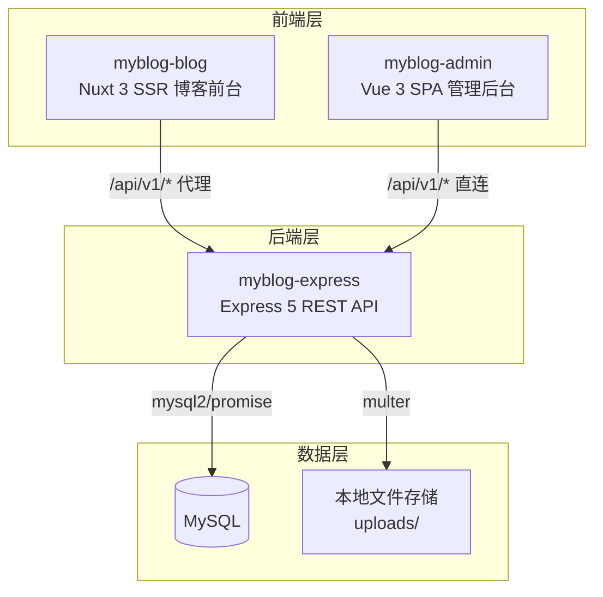

# MyBlog — 全栈博客系统

一个基于 **Node.js + Express + Nuxt 3 + Vue 3** 的全栈个人博客系统，包含博客前台展示、后台内容管理、在线编程工具箱三大模块。

---

## 📋 目录

- [项目架构](#项目架构)
- [技术栈](#技术栈)
- [项目结构](#项目结构)
- [功能特性](#功能特性)
- [快速开始](#快速开始)
- [环境变量](#环境变量)
- [API 接口文档](#api-接口文档)
- [工具箱](#工具箱)
- [SEO 实现](#seo-实现)
- [部署指南](#部署指南)
- [常见问题](#常见问题)
- [后续优化计划](#后续优化计划)

---

## 项目架构



| 项目                      | 定位                     | 端口      | 框架         |
| ------------------------- | ------------------------ | --------- | ------------ |
| `myblog-express`          | REST API 后端服务        | `3000`    | Express 5    |
| `myblog-vue/myblog-blog`  | 博客前台 + 工具箱（SSR） | `3001`    | Nuxt 3       |
| `myblog-vue/myblog-admin` | 后台管理系统（SPA）      | Vite 默认 | Vue 3 + Vite |

---

## 技术栈

### 后端 (`myblog-express`)

| 类别       | 方案                          | 版本            |
| ---------- | ----------------------------- | --------------- |
| 运行时     | Node.js                       | —               |
| Web 框架   | Express                       | ^5.2.1          |
| 数据库     | MySQL                         | —               |
| 数据库驱动 | mysql2/promise                | ^3.20.0         |
| 认证       | JWT (jsonwebtoken + bcryptjs) | ^9.0.3 / ^3.0.3 |
| 文件上传   | multer                        | ^2.1.1          |
| 安全       | helmet                        | ^8.1.0          |
| 跨域       | cors                          | ^2.8.6          |
| 日志       | morgan                        | ^1.10.1         |
| 参数校验   | express-validator             | ^7.3.1          |

### 博客前台 (`myblog-blog`)

| 类别      | 方案         | 版本    |
| --------- | ------------ | ------- |
| 框架      | Nuxt 3       | ^3.17.7 |
| 语言      | TypeScript   | —       |
| UI 组件库 | Element Plus | ^2.13.6 |
| 状态管理  | Pinia        | —       |
| Markdown  | markdown-it  | ^14.1.0 |
| 代码高亮  | highlight.js | ^11.9.0 |
| 日期处理  | dayjs        | —       |
| 工具计算  | Web Worker   | —       |

### 管理后台 (`myblog-admin`)

| 类别        | 方案             | 版本    |
| ----------- | ---------------- | ------- |
| 框架        | Vue 3            | ^3.5.30 |
| 构建        | Vite             | —       |
| 路由        | Vue Router       | ^5.0.3  |
| 状态管理    | Pinia            | ^3.0.4  |
| UI 组件库   | Element Plus     | ^2.13.6 |
| HTTP 客户端 | Axios            | ^1.13.6 |
| 富文本编辑  | @vueup/vue-quill | ^1.2.0  |
| 图表        | ECharts          | ^6.0.0  |

---

## 项目结构

```
myblog/
├── myblog-express/                # 后端 API 服务
│   ├── config/                    # 数据库、JWT、上传配置
│   │   ├── database.js
│   │   ├── jwt.js
│   │   └── upload.js
│   ├── controllers/               # 控制器（业务逻辑）
│   │   ├── articleController.js
│   │   ├── bloggerController.js
│   │   ├── commentController.js
│   │   ├── dashboardController.js
│   │   ├── labelController.js
│   │   ├── settingController.js
│   │   ├── typeController.js
│   │   └── uploadController.js
│   ├── middleware/                # 中间件
│   │   ├── auth.js                # JWT 认证
│   │   ├── role.js                # 角色权限
│   │   ├── validator.js           # 参数校验
│   │   └── errorHandler.js        # 全局错误处理
│   ├── models/                    # 数据访问层
│   │   ├── Article.js
│   │   ├── Blogger.js
│   │   ├── Comment.js
│   │   ├── Label.js
│   │   ├── Setting.js
│   │   └── Type.js
│   ├── routes/                    # 路由定义
│   ├── scripts/                   # 初始化脚本
│   ├── utils/                     # 工具函数
│   ├── uploads/                   # 上传文件目录
│   ├── app.js                     # Express 装配
│   ├── server.js                  # 服务入口
│   └── myblog.sql                 # 数据库初始化 SQL
│
├── myblog-vue/
│   ├── myblog-blog/               # Nuxt 3 博客前台
│   │   ├── api/                   # API 封装
│   │   ├── assets/                # 全局样式
│   │   ├── components/            # 组件
│   │   │   ├── common/            # 通用组件
│   │   │   ├── layout/            # 布局组件（Header/Footer）
│   │   │   └── tools/             # 工具箱组件
│   │   ├── composables/           # 组合式函数
│   │   │   ├── usePageSeo.ts      # SEO 动态注入
│   │   │   └── useTool.ts         # 工具箱逻辑
│   │   ├── config/
│   │   │   └── tools.ts           # 工具箱元数据配置
│   │   ├── layouts/               # Nuxt 布局
│   │   │   ├── default.vue        # 博客默认布局
│   │   │   └── tools.vue          # 工具箱布局
│   │   ├── pages/                 # 约定式路由页面
│   │   │   ├── index.vue          # 首页
│   │   │   ├── article/[id].vue   # 文章详情
│   │   │   ├── category/          # 分类
│   │   │   ├── tag/               # 标签
│   │   │   ├── archive.vue        # 归档
│   │   │   ├── about.vue          # 关于
│   │   │   ├── search.vue         # 搜索
│   │   │   └── tools/             # 工具箱页面
│   │   ├── server/                # 服务端路由
│   │   │   ├── api/v1/[...segments].ts  # API 代理
│   │   │   └── routes/sitemap.xml.ts    # 动态站点地图
│   │   ├── stores/                # Pinia Store
│   │   ├── types/                 # TypeScript 类型
│   │   ├── utils/                 # 工具函数与算法
│   │   ├── app.vue                # 根组件
│   │   └── nuxt.config.ts         # Nuxt 配置
│   │
│   └── myblog-admin/              # Vue 3 管理后台
│       ├── src/
│       │   ├── api/index.ts       # API 封装
│       │   ├── layouts/           # 管理布局
│       │   ├── router/index.ts    # 路由与守卫
│       │   ├── stores/            # Pinia Store
│       │   │   ├── user.ts        # 用户认证
│       │   │   └── settings.ts    # 站点配置
│       │   ├── types/             # TS 类型
│       │   ├── utils/request.ts   # Axios 封装
│       │   └── views/             # 页面
│       │       ├── Login.vue
│       │       ├── Dashboard.vue
│       │       ├── article/       # 文章管理
│       │       ├── TypeManage.vue
│       │       ├── LabelManage.vue
│       │       ├── CommentManage.vue
│       │       ├── Profile.vue
│       │       └── Settings.vue
│       └── vite.config.ts
│
├── 交接文档/                       # 项目交接说明文档
└── README.md                      # 本文件
```

---

## 功能特性

### 博客前台

- ✅ SSR 服务端渲染，SEO 友好
- ✅ 文章列表、详情、分类、标签、归档
- ✅ 全站搜索
- ✅ 动态 sitemap.xml 生成
- ✅ Open Graph / Twitter Card 元标签
- ✅ 响应式布局，移动端适配
- ✅ 评论提交与展示

### 编程工具箱（纯前端）

- ✅ **编解码**：Base64、URL、Unicode、HTML Entity
- ✅ **格式化**：JSON 格式化/压缩、SQL 格式化、XML 格式化
- ✅ **加密与时间**：MD5、SHA-1/256/512、时间戳转换
- ✅ **文本处理**：正则测试、字符统计、大小写转换
- ✅ **颜色工具**：HEX ↔ RGB、颜色选择器
- ✅ 防抖输入、localStorage 记忆、结果复制/导出
- ✅ `Ctrl/Cmd + K` 快捷切换工具
- ✅ Web Worker 异步计算

### 管理后台

- ✅ JWT 登录认证
- ✅ 仪表盘数据概览（ECharts 图表）
- ✅ 文章 CRUD（草稿/发布、软删除/恢复/彻底删除）
- ✅ 分类与标签管理
- ✅ 评论审核（通过/待审/垃圾/删除）
- ✅ 个人资料与密码修改
- ✅ 全站配置管理（文本/图片/HTML/布尔）

---

## 快速开始

### 前置要求

- **Node.js** ≥ 20.19
- **MySQL** 数据库
- **npm**

### 1. 初始化数据库

```bash
# 创建数据库并导入结构
mysql -u root -p -e "CREATE DATABASE IF NOT EXISTS myblog DEFAULT CHARACTER SET utf8mb4 COLLATE utf8mb4_unicode_ci;"
mysql -u root -p myblog < myblog-express/myblog.sql
```

### 2. 启动后端

```bash
cd myblog-express
npm install
npm run dev
# 服务运行在 http://localhost:3000
# 启动时会自动初始化博主账号
```

### 3. 启动管理后台

```bash
cd myblog-vue/myblog-admin
npm install
npm run dev
# 默认 Vite 开发服务器地址
```

### 4. 启动博客前台

```bash
cd myblog-vue/myblog-blog
npm install
npm run dev
# 服务运行在 http://localhost:3001
```

### 5. 验证

- **博客前台**：访问 `http://localhost:3001`
- **管理后台**：访问 Vite 开发地址，使用初始化的博主账号登录
- **API 健康检查**：`curl http://localhost:3000/api/v1/settings`

---

## 环境变量

### 后端 `myblog-express`

```env
PORT=3000                          # 服务端口
DB_HOST=localhost                  # 数据库地址
DB_USER=root                       # 数据库用户
DB_PASSWORD=root                   # 数据库密码
DB_NAME=myblog                     # 数据库名称
JWT_SECRET=your-secret-key         # JWT 签名密钥（生产必须修改）
JWT_EXPIRES_IN=7d                  # Token 过期时间
FRONTEND_ORIGIN=http://localhost:3001  # 前台地址（CORS 白名单）
```

### 博客前台 `myblog-blog`

```env
NUXT_API_BASE=http://localhost:3000/api/v1   # 后端 API 地址
NUXT_SITE_URL=http://localhost:3001           # 站点公网地址
```

> **注意**：管理后台 `myblog-admin` 的 API 地址当前写死在 `src/utils/request.ts` 中，如需修改请直接编辑该文件。

---

## API 接口文档

### 基础信息

- **Base URL**：`http://localhost:3000/api/v1`
- **认证方式**：`Authorization: Bearer <token>`（仅管理类接口需要）
- **响应格式**：

```json
{
  "code": 200,
  "message": "操作成功",
  "data": {}
}
```

### 文章（Articles）

| 方法     | 路径                    | 说明                  | 认证   |
| -------- | ----------------------- | --------------------- | ------ |
| `GET`    | `/articles`             | 文章列表（分页/筛选） | 可选   |
| `GET`    | `/articles/trash`       | 回收站列表            | 管理员 |
| `GET`    | `/articles/:id`         | 文章详情              | 可选   |
| `POST`   | `/articles`             | 创建文章              | 管理员 |
| `PUT`    | `/articles/:id`         | 更新文章              | 管理员 |
| `DELETE` | `/articles/:id`         | 软删除（移入回收站）  | 管理员 |
| `PUT`    | `/articles/:id/restore` | 恢复文章              | 管理员 |
| `DELETE` | `/articles/:id/hard`    | 彻底删除              | 管理员 |

### 分类（Types）

| 方法     | 路径         | 说明     | 认证   |
| -------- | ------------ | -------- | ------ |
| `GET`    | `/types`     | 分类列表 | 公开   |
| `POST`   | `/types`     | 创建分类 | 管理员 |
| `PUT`    | `/types/:id` | 更新分类 | 管理员 |
| `DELETE` | `/types/:id` | 删除分类 | 管理员 |

### 标签（Labels）

| 方法     | 路径          | 说明     | 认证   |
| -------- | ------------- | -------- | ------ |
| `GET`    | `/labels`     | 标签列表 | 公开   |
| `POST`   | `/labels`     | 创建标签 | 管理员 |
| `PUT`    | `/labels/:id` | 更新标签 | 管理员 |
| `DELETE` | `/labels/:id` | 删除标签 | 管理员 |

### 评论（Comments）

| 方法   | 路径                   | 说明         | 认证   |
| ------ | ---------------------- | ------------ | ------ |
| `GET`  | `/comments`            | 评论列表     | 可选   |
| `POST` | `/comments`            | 发布评论     | 公开   |
| `PUT`  | `/comments/:id/status` | 更新评论状态 | 管理员 |
| `POST` | `/comments/:id/like`   | 点赞评论     | 公开   |

### 博主（Blogger）

| 方法   | 路径               | 说明         | 认证   |
| ------ | ------------------ | ------------ | ------ |
| `POST` | `/blogger/login`   | 登录         | 公开   |
| `GET`  | `/blogger/profile` | 获取博主资料 | 管理员 |
| `PUT`  | `/blogger/profile` | 更新博主资料 | 管理员 |

### 设置（Settings）

| 方法  | 路径        | 说明         | 认证   |
| ----- | ----------- | ------------ | ------ |
| `GET` | `/settings` | 获取所有配置 | 公开   |
| `PUT` | `/settings` | 批量更新配置 | 管理员 |

### 仪表盘（Dashboard）

| 方法  | 路径                | 说明     | 认证   |
| ----- | ------------------- | -------- | ------ |
| `GET` | `/dashboard/stats`  | 统计概览 | 管理员 |
| `GET` | `/dashboard/charts` | 图表数据 | 管理员 |

### 上传（Upload）

| 方法   | 路径      | 说明     | 认证   |
| ------ | --------- | -------- | ------ |
| `POST` | `/upload` | 上传文件 | 管理员 |

---

## 工具箱

工具箱位于博客前台的 `/tools` 路径下，采用**配置驱动 + 通用工作台 + 纯函数算法**架构。

### 工具分类

| 分类                    | 工具                                                        |
| ----------------------- | ----------------------------------------------------------- |
| **编解码** (encoding)   | Base64 编解码、URL 编解码、Unicode 转换、HTML Entity 编解码 |
| **格式化** (formatter)  | JSON 格式化/压缩、SQL 格式化、XML 格式化                    |
| **加密与时间** (crypto) | MD5 生成、SHA-1/256/512、时间戳转换                         |
| **文本处理** (text)     | 正则测试、字符统计、大小写转换                              |
| **颜色工具** (color)    | HEX ↔ RGB、颜色选择器                                       |

### 架构设计

```
用户输入 → ToolInput → useTool (防抖/持久化) → processor → Web Worker → ToolOutput
```

- 输入大小限制 1MB
- localStorage 记忆最近输入和选项
- 支持复制、导出、清空、示例填充、输入输出交换
- `Ctrl/Cmd + K` 快捷切换工具

---

## SEO 实现

博客前台已实现完整的 SEO 能力：

### 全站级 SEO

- 通过 `nuxt.config.ts` 配置 `titleTemplate`、默认 `description`、favicon
- 全局 Open Graph 和 Twitter Card 标签

### 页面级 SEO

- `composables/usePageSeo.ts` 动态注入每个页面的 title、description、canonical
- 文章详情页额外输出 `article:published_time` 和 `article:tag`

### 站点地图

- `server/routes/sitemap.xml.ts` 动态生成 XML
- 包含静态路由和所有文章、分类、标签的动态 URL

### 抓取规则

- `public/robots.txt` 配置搜索引擎抓取策略

---

## 部署指南

### 生产构建

```bash
# 后端
cd myblog-express
npm install --production
npm run start

# 博客前台
cd myblog-vue/myblog-blog
npm install
npm run build
node .output/server/index.mjs

# 管理后台
cd myblog-vue/myblog-admin
npm install
npm run build
# 将 dist/ 部署到静态服务器或 CDN
```

### 推荐部署方案

```
Nginx (反向代理)
├── /api/v1/*  →  myblog-express:3000
├── /uploads/*  →  myblog-express:3000/uploads (或 CDN)
├── /admin/*    →  myblog-admin 静态文件
└── /*          →  myblog-blog:3001 (Nuxt SSR)
```

### 生产环境检查清单

- [ ] 修改 `JWT_SECRET` 为强随机字符串
- [ ] 配置 HTTPS
- [ ] 设置 MySQL 密码并限制网络访问
- [ ] 将 `uploads/` 迁移至对象存储（推荐）
- [ ] 配置 `NUXT_SITE_URL` 为真实域名
- [ ] 配置 `FRONTEND_ORIGIN` 为真实前台域名
- [ ] 管理后台 API 地址改为环境变量
- [ ] 设置 `NODE_ENV=production`

---

## 常见问题

### Q: 启动后端后无法登录后台？

确保 MySQL 已启动且 `myblog.sql` 已导入。服务启动时会自动执行 `initBlogger()` 初始化博主账号。检查控制台日志确认初始化是否成功。

### Q: 博客前台页面白屏或数据不显示？

1. 确认后端已启动（`http://localhost:3000/api/v1/settings` 可访问）
2. 确认 `NUXT_API_BASE` 环境变量配置正确
3. 检查浏览器控制台是否有跨域错误

### Q: 上传图片后无法显示？

确认 `uploads/` 目录存在且有写入权限，静态资源路径 `/uploads` 已正确代理。

### Q: 工具箱工具计算结果不正确？

工具箱为纯前端实现，请检查浏览器控制台是否有 Worker 相关的错误信息。

---

## 后续优化计划

详见 [项目后续优化更新文档](./项目优化更新计划.md)。

主要包括：

- chunk 体积优化与拆包
- 上传模块迁移至对象存储
- 管理后台 API 地址环境变量化
- 自动化测试补齐
- CI/CD 流水线搭建
- 暗色主题与无障碍增强

---

## 项目状态

| 项目             | 状态      | 类型检查 | 生产构建 |
| ---------------- | --------- | -------- | -------- |
| `myblog-express` | ✅ 运行中 | N/A      | N/A      |
| `myblog-blog`    | ✅ 运行中 | ✅ 通过  | ✅ 通过  |
| `myblog-admin`   | ✅ 运行中 | ✅ 通过  | ✅ 通过  |
