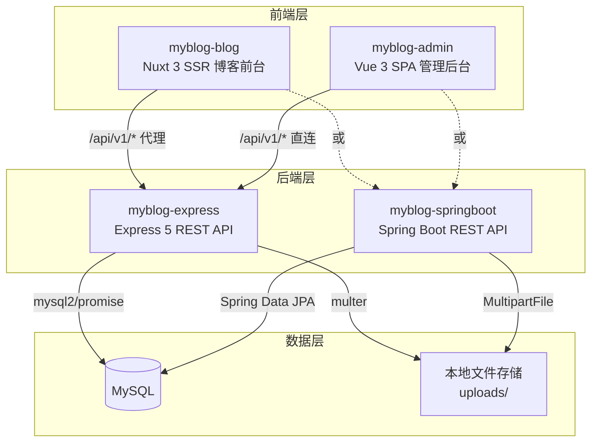

# MyBlog — 全栈博客系统

一个基于 **Node.js + Express / Spring Boot + Nuxt 3 + Vue 3** 的全栈个人博客系统，包含博客前台展示、后台内容管理、在线编程工具箱三大模块。

> 后端提供 **Express (Node.js)** 和 **Spring Boot (Java)** 两种实现，功能完全等价，可按技术栈偏好选择部署。

---

## 项目架构



| 项目                      | 定位                     | 端口      | 框架          |
| ------------------------- | ------------------------ | --------- | ------------- |
| `myblog-express`          | REST API 后端服务 (Node) | `3000`    | Express 5     |
| `myblog-springboot`       | REST API 后端服务 (Java) | `3000`    | Spring Boot 4 |
| `myblog-vue/myblog-blog`  | 博客前台 + 工具箱（SSR） | `3001`    | Nuxt 3        |
| `myblog-vue/myblog-admin` | 后台管理系统（SPA）      | Vite 默认 | Vue 3 + Vite  |

---

## 技术栈

- **后端 (Express)**: Node.js 、Express 、MySQL 、Redis 、JWT + bcryptjs、sharp、Meilisearch、nodemailer (详见 [myblog-express/README.md](./myblog-express/README.md))
- **后端 (Spring Boot)**: JDK 、Spring Boot 、Spring Security + JWT (jjwt)、JPA、Redis、webp-imageio、Actuator (详见 [myblog-springboot/README.md](./myblog-springboot/README.md))
- **博客前台**: Nuxt + TypeScript、Element Plus、Pinia、markdown-it、highlight.js、dayjs (详见 [myblog-blog/README.md](./myblog-vue/myblog-blog/README.md))
- **管理后台**: Vue + Vite、Pinia、Element Plus、Axios、vue-quill、ECharts (详见 [myblog-admin/README.md](./myblog-vue/myblog-admin/README.md))

---

## 项目结构

```
myblog-express/                  # 后端 — Express (Node.js)
├── config/                      # 配置（数据库、JWT、上传、日志、Redis）
├── controllers/                 # 控制器
├── middleware/                  # 中间件（认证、角色、限流、缓存、校验、错误处理、性能监控）
├── models/                      # 数据模型
├── routes/                      # 路由（含 cache/metrics 运维接口）
├── scripts/                     # 初始化脚本
├── services/                    # 服务（meilisearch、mailer、commentNotifier）
├── test/                        # 集成测试
├── uploads/                     # 上传文件目录
├── Dockerfile                   # Docker 镜像
├── .env.example                 # 环境变量模板
└── package.json

myblog-springboot/               # 后端 — Spring Boot (Java)
├── Dockerfile                   # Docker 镜像（多阶段 Maven 构建）
├── pom.xml                      # Maven 依赖配置
└── src/main/
    ├── java/com/myblog/myblogspringboot/
    │   ├── config/              # 配置（Security、CORS、缓存统计拦截器、初始化）
    │   ├── controller/          # 控制器（REST API，含 cache 运维接口）
    │   ├── dto/                 # 请求/响应 DTO
    │   ├── entity/              # JPA 实体（Article、Comment 等）
    │   ├── exception/           # 全局异常处理
    │   ├── repository/          # Spring Data JPA Repository
    │   ├── security/            # JWT Token 认证
    │   └── service/             # 业务逻辑层（含 Mail/评论通知/缓存统计）
    └── resources/
        └── application.yml      # 应用配置

myblog-vue/
├── myblog-blog/                 # 博客前台（Nuxt 3 SSR）
│   ├── Dockerfile               # Docker 镜像（SSR 构建 + 运行）
│   ├── api/                     # API 封装
│   ├── assets/css/              # 全局样式与 CSS 变量
│   ├── components/              # 组件（common / layout / tools）
│   ├── composables/             # 组合式函数（SEO、JSON-LD、i18n、工具）
│   ├── layouts/                 # 布局
│   ├── locales/                 # i18n 词条（zh / en）
│   ├── pages/                   # 页面
│   ├── plugins/                 # Element Plus 插件
│   ├── server/                  # Nitro（API 代理、sitemap、/uploads 代理）
│   ├── stores/                  # Pinia（设置、博主、主题）
│   ├── types/                   # TypeScript 类型
│   └── utils/                   # 工具函数、格式、SEO、Gravatar、图片 URL 归一化
│
└── myblog-admin/                # 后台管理（Vue 3 SPA）
    ├── Dockerfile               # Docker 镜像（构建 + Nginx）
    ├── src/
    │   ├── assets/css/          # 设计令牌 + Element Plus 暗色覆盖
    │   └── api/ / layouts/ / router/ / stores/ / types/ / utils/ / views/
    ├── nginx.conf                # Nginx 配置（SPA 路由）
    └── package.json
├── docker-compose.yml              # Docker Compose 编排（一键部署）
├── .env.docker.example             # Docker 环境变量模板
├── DEPLOY.md                       # Docker 部署详细指南
└── README.md
```

---

## 快速开始

### 前提条件

- **Express 后端**：Node.js >= 20.19
- **Spring Boot 后端**：JDK 17+、Maven 3.8+
- MySQL >= 8.0
- Redis >= 6.0（可选，不部署则缓存功能自动降级）

### 1. 初始化数据库

```bash
mysql -u root -p -e "CREATE DATABASE myblog CHARACTER SET utf8mb4 COLLATE utf8mb4_unicode_ci;"
mysql -u root -p myblog < myblog-express/myblog-1.1.sql
```

### 2. 启动后端（二选一）

#### 方式 A：Express（Node.js）

```bash
cd myblog-express
cp .env.example .env   # 编辑数据库密码和 JWT_SECRET
npm install
npm run dev             # http://localhost:3000
```

#### 方式 B：Spring Boot（Java）

```bash
cd myblog-springboot
# 编辑 src/main/resources/application.yml 中的数据库连接信息
# 或通过环境变量设置: DB_HOST, DB_USER, DB_PASSWORD, DB_NAME, JWT_SECRET
./mvnw spring-boot:run    # http://localhost:3000
```

> 首次启动自动创建默认博主（admin / admin123），请及时修改默认密码。

### 3. 启动博客前台

```bash
cd myblog-vue/myblog-blog
npm install
npm run dev             # http://localhost:3001
```

> 开发服务器监听 `0.0.0.0`，同一 WiFi 下手机可通过 `http://<电脑IP>:3001` 访问测试；
> 图片/API 经 Nuxt 代理转发，手机端无需额外配置。

### 4. 启动管理后台

```bash
cd myblog-vue/myblog-admin
cp .env.example .env
npm install
npm run dev             # http://localhost:5173
```

> 开发环境 API 走 Vite 代理（相对路径 `/api/v1` 转发到本机 3000），
> 手机通过 `http://<电脑IP>:5173` 访问同样可正常请求接口。

---

## 环境变量

各子项目均有 `.env.example` 模板，复制为 `.env` 即可使用。**生产必改** `JWT_SECRET` 与数据库密码。

- **Express**: 见 [myblog-express/README.md](./myblog-express/README.md)（含 `NODE_ENV`/`PORT`/`DB_*`/`JWT_*`/`SMTP_*` 等）
- **Spring Boot**: 见 [myblog-springboot/README.md](./myblog-springboot/README.md)（含 `DB_*`/`JWT_*`/`MEILI_*`/`REDIS_*` 等）
- **管理后台**: 见 [myblog-admin/README.md](./myblog-vue/myblog-admin/README.md)（`VITE_API_BASE`）

---

## Redis 缓存策略

| 特性          | 说明                                                                 |
| ------------- | -------------------------------------------------------------------- |
| 缓存对象      | 仅缓存 GET 请求的 JSON 响应                                          |
| 缓存键        | `cache:{prefix}:{queryString}`（Spring Boot 为 `分区名::key`）       |
| 默认 TTL      | 300 秒（5 分钟）                                                     |
| Cache-Control | `public, max-age=300, stale-while-revalidate=600`                    |
| 命中统计      | 进程内记录 hits/misses，`GET /api/v1/cache/stats` 查看命中率         |
| 缓存预热      | 启动时自动预取 settings/types/labels，后台可手动触发                 |
| 一键清空      | `POST /api/v1/cache/clear`（管理后台"运维监控"页）                   |
| 降级策略      | Redis 不可用时自动跳过缓存，直查数据库（Spring Boot 降级为内存缓存） |
| 写失效        | POST/PUT/DELETE 操作可调用 `cache.invalidate(prefix)` 主动清除       |

---

## API 接口

> 前缀 `/api/v1`，统一响应 `{ code, message, data }`。

| 方法                  | 路径                                           | 说明                         | 认证     |
| --------------------- | ---------------------------------------------- | ---------------------------- | -------- |
| `GET`                 | `/health`                                      | 健康检查（DB/Redis/Meili）   | 否       |
| `GET/POST`            | `/articles`                                    | 文章列表 / 创建              | 读写分离 |
| `GET/PUT/DELETE`      | `/articles/:id`                                | 文章详情 / 更新 / 软删除     | —        |
| `GET/POST`            | `/comments`                                    | 评论列表 / 发布              | 否       |
| `PUT/DELETE`          | `/comments/:id/...`                            | 审核 / 删除 / 点赞 / 恢复    | 混合     |
| `POST`                | `/blogger/login`                               | 博主登录                     | 否       |
| `GET`                 | `/blogger/public-profile`                      | 博主公开信息                 | 否       |
| `GET/PUT`             | `/settings`                                    | 网站配置读写                 | 读公开   |
| `GET/POST/PUT/DELETE` | `/types` `/labels`                             | 分类 / 标签 CRUD             | —        |
| `GET/POST/PUT/DELETE` | `/friend-links`                                | 友链 CRUD（GET 仅启用）      | 读公开   |
| `POST`                | `/friend-links/:id/click`                      | 友链点击计数                 | 否       |
| `POST`                | `/upload/image`                                | 上传图片（自动生成 WebP）    | admin    |
| `GET`                 | `/dashboard/stats` `/dashboard/charts`         | 仪表盘                       | admin    |
| `GET/POST`            | `/cache/stats` `/cache/clear` `/cache/preheat` | 缓存运维（命中率/清空/预热） | admin    |
| `GET`                 | `/metrics`                                     | 性能监控（响应时间/错误率）  | admin    |

---

## 数据库

| 表              | 说明                                     |
| --------------- | ---------------------------------------- |
| `article`       | 文章（软删除）                           |
| `article_label` | 文章-标签关联                            |
| `blogger`       | 博主                                     |
| `comment`       | 评论（访客：昵称/邮箱/网址）             |
| `friend_link`   | 友情链接（头像/简介/邮箱/置顶/点击统计） |
| `label`         | 标签                                     |
| `setting`       | 网站配置                                 |
| `type`          | 分类                                     |

---

## 测试

```bash
# Express 后端集成测试
cd myblog-express && npm test

# Spring Boot 后端测试
cd myblog-springboot && ./mvnw test

# 博客前台工具箱单元测试
cd myblog-vue/myblog-blog && npm test
```

---

## 部署

> 🐳 **推荐使用 Docker Compose 一键部署**，5 个容器（MySQL + Redis + 后端 + 博客 + 管理后台）自动编排。

### Docker 部署（推荐）

```bash
# 1. 配置环境变量
cp .env.docker.example .env.docker
# 编辑 .env.docker，修改 DB_PASSWORD 和 JWT_SECRET

# 2. 一键构建并启动
docker compose --env-file .env.docker up -d --build

# 3. 访问
#   博客前台: http://localhost:3001
#   管理后台: http://localhost:3002
#   API 接口: http://localhost:3000/api/v1
```

详细说明（环境变量、后端切换 Spring Boot、数据备份、生产建议等）请参阅 **[DEPLOY.md](./DEPLOY.md)**。

### 手动部署

```bash
# Express 后端
cd myblog-express && NODE_ENV=production npm start

# Spring Boot 后端
cd myblog-springboot && ./mvnw package -DskipTests
java -jar target/myblog-springboot-0.0.1-SNAPSHOT.jar

# 博客前台
cd myblog-vue/myblog-blog && npm run build   # → dist/

# 管理后台
cd myblog-vue/myblog-admin && npm run build   # → dist/
```

---

## 📝 版本记录

| 日期       | 版本 | 说明                                                                                                                                                                                                                                                                         |
| ---------- | ---- | ---------------------------------------------------------------------------------------------------------------------------------------------------------------------------------------------------------------------------------------------------------------------------- |
| 2026-08-31 | v2.5 | 首页秩序化网格重构（移除 Bento/热门大面板，改为 3/2/1 列网格 + 公告栏 + 博主信息卡）；settings 支持自定义 Key-Value 配置（双后端 CRUD + 后台「自定义配置」Tab）；修复 Nuxt 前台 Docker 构建（先 COPY 源码再 `npm install` + alpine 编译工具链） |
| 2026-08-22 | v2.4 | 首页 Bento 布局改版（最新/热门并排等高、响应式 3/2 张）、主题色亮/暗分离、封面主图/缩略图策略优化、Markdown 摘要正则修复；新增友情链接体系（`/friends` 独立页 + 友链表 `friend_link` + Express/Spring Boot 接口对齐 + 后台友链管理）与分页默认每页 4 条                      |
| 2026-08-04 | v2.3 | 全面重构：统一设计系统、前台/后台视觉升级（含 Header 磨砂配色）、系统设置分组化、工具箱收藏、评论@提及与邮件通知、编辑器自动保存/预览、缓存预热与统计、图片 WebP 落地、Spring Boot 功能对齐、限流按真实访客 IP、局域网手机联调支持                                           |
| 2026-06-27 | v2.2 | Docker 容器化部署支持（docker-compose.yml + Dockerfile × 4 + DEPLOY.md）                                                                                                                                                                                                     |
| 2026-06-10 | v2.1 | 新增 Spring Boot 后端实现（myblog-springboot），与 Express 功能等价                                                                                                                                                                                                          |
| 2026-06-08 | v2.0 | 访客评论增强、暗色主题、SEO 优化、代码分隔、类型统一、测试/CI/CD 基础设施                                                                                                                                                                                                    |
